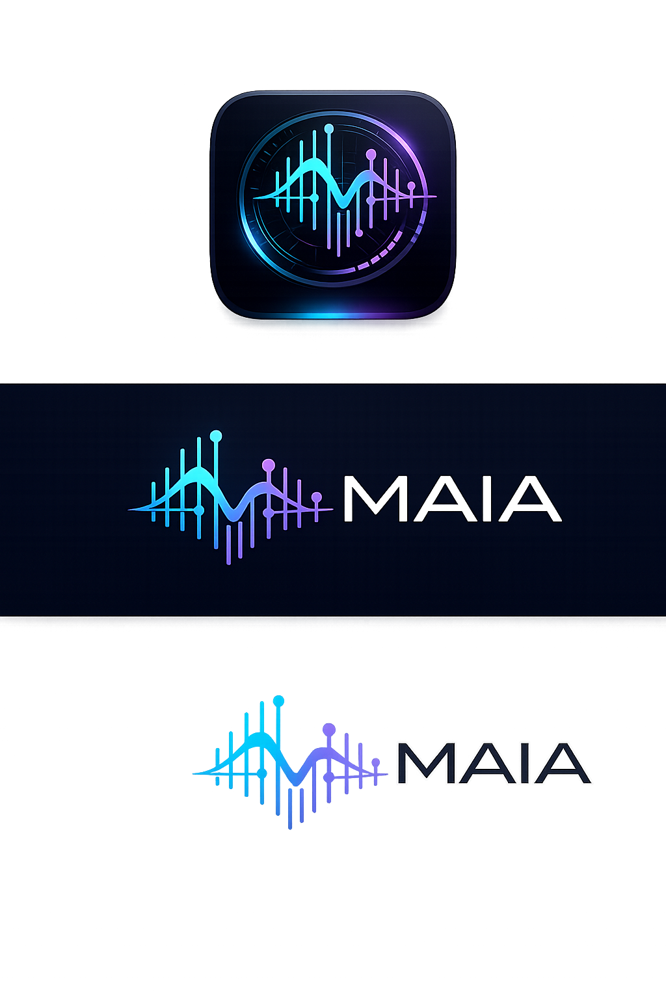

comaia

## Graphics





Local-first desktop app for code/log sonification and music analysis. Maia combines a Tauri + React + TypeScript shell, a Python analyzer, SQLite storage, and JSON contracts over IPC.

## Product premise

Maia is not just a DJ-style analyzer. The product goal is to turn patterns in codebases and logs into audible structure:

- teams should be able to hear system or repository behavior as music
- anomalous events in logs or code should produce distinct sonic changes
- reusable sonic assets should become the vocabulary used to mark events, tension, drift, and structure
- imported tracks are a support lane for reference, calibration, and comparison, not the core business output

Current MVP already supports repository intake, reusable base assets, composition previews derived from local assets, and a first live log-tail runtime flow inside the analyzer screen. The current live stream implementation is local-file polling, not a generalized multi-source observability ingest layer yet.

## Repository layout

- `desktop/`: Tauri desktop app and React UI
- `desktop/src/config/`: local import configuration, including curated music styles and base asset categories
- `analyzer/`: Python analyzer CLI
- `contracts/`: JSON schema contracts shared across desktop and analyzer
- `database/`: SQLite schema
- `docs/`: bootstrap architecture notes

## Setup

### Desktop

```bash
cd desktop
npm install
```

### Analyzer

```bash
cd analyzer
python3 -m venv .venv
. .venv/bin/activate
pip install -e .
```

## Run

### Frontend only

```bash
cd desktop
npm run dev
```

### Full desktop app

```bash
cd analyzer
python3 -m venv .venv
. .venv/bin/activate
pip install -e .
cd ../desktop
npm run tauri dev
```

### Analyzer CLI

```bash
cd analyzer
. .venv/bin/activate
python -m maia_analyzer.cli health
printf '%s\n' '{"contractVersion":"1.0","requestId":"demo","action":"analyze","payload":{"assetType":"repo_analysis","source":{"kind":"directory","path":".."},"options":{"inferCodeSuggestedBpm":true}}}' | python -m maia_analyzer.cli analyze
printf '%s\n' '{"contractVersion":"1.0","requestId":"demo-url","action":"analyze","payload":{"assetType":"repo_analysis","source":{"kind":"url","path":"https://github.com/fabianaguero/maia"},"options":{"inferCodeSuggestedBpm":true}}}' | python -m maia_analyzer.cli analyze
```

## Notes

- Source of truth for IPC payloads: `contracts/*.schema.json`
- Initial SQLite schema: `database/schema.sql`
- The desktop bridge auto-detects `analyzer/.venv` when present; override with `MAIA_PYTHON` if you want a different interpreter
- The desktop library screen supports code-project intake from a local directory path, local log-file intake, or a GitHub URL
- Track import now requires choosing a music style from `desktop/src/config/music-styles.json` before persisting the track
- Base asset registration now requires choosing a curated category from `desktop/src/config/base-asset-categories.json`
- Base assets should be understood as reusable sonic building blocks for code/log sonification, not just a sample library
- Native desktop pickers remain delegated to the OS when available; manual path entry remains as fallback
- File parsing and analysis stay inside the app stack: repository heuristics run in Python, and track intake uses embedded decoders plus in-analyzer heuristics instead of system media tools
- The embedded track decoder now supports `wav`, `mp3`, `flac`, and `ogg/vorbis` inside the analyzer; unsupported formats such as `m4a` still fall back to deterministic local stubs for MVP
- In Tauri, when the selected track file exists locally in a supported format, Maia snapshots it into managed local storage and persists heuristic waveform bins, BPM, beat grid, and duration from the analyzer; non-existent demo paths still fall back to deterministic local stubs
- The analyzer screen can now audition managed track snapshots directly inside Maia, keeping cue review and BPM inspection in-app instead of bouncing to an external player
- In Tauri, local repository imports are also snapshotted into managed local storage before Python heuristics run; GitHub URLs remain metadata-only references
- Repository analysis is the first real code-driven signal lane in MVP; it already produces deterministic musical metadata and can act as tempo/reference input for later composition flows
- Local log-file import is now the first real log sonification lane in MVP: Maia snapshots the file, extracts severities/bursts/anomaly markers, derives a deterministic signal BPM plus visual log cadence panel, and can then keep listening to the original file through an internal live-tail monitor
- The analyzer screen now includes a live log monitor for local log-file sources: Maia polls appended bytes from the original file, sends each fresh window through the analyzer JSON contract, and emits musical cues with Web Audio directly inside the app
- The live log monitor can now load a runtime sonification scene from a selected `base_asset` plus an optional `composition_result`, so severity/anomaly cues route through Maia's reusable sonic vocabulary and arrangement strategy instead of staying generic
- If that selected `base_asset` exposes a playable managed audio file, the live monitor now triggers real sample audio from it; otherwise it falls back to internal Web Audio synthesis
- Folder-pack `base_asset` imports now expose `playableAudioEntries` and `audioEntryCount`, and the live monitor can map different severities/anomaly routes onto different managed samples from that pack
- The analyzer screen now renders the persisted waveform, beat grid, and BPM curve directly from local storage instead of treating beat artifacts as hidden backend-only data
- Base assets can now be registered from a local file or folder path, stored in SQLite as reusable references, and inspected in a dedicated analyzer view with checksum, entry count, and category metadata
- In Tauri, base assets are snapshotted into managed local storage under Maia during import; browser fallback keeps the same record shape without creating a native on-disk copy
- Composition results can now be created inside the app from one registered base asset plus a track BPM, repository BPM, or manual BPM reference
- Composition results should be read as sonification/composition plans derived from code or reusable sonic material, not just DJ sketches
- Composition results are persisted locally as deterministic arrangement plans with waveform/beat-grid/BPM-curve preview artifacts, phrase sections, cue points, and render-preview stems/automation, and in Tauri each result is also materialized as a managed internal `plan.json` plus deterministic `preview.wav` under Maia storage; the analyzer screen can now audition that managed preview audio inside Maia, but they are not rendered final audio exports in MVP
- Live log stream sonification is now implemented for local growing files through an internal `tail -f` style polling loop in the analyzer screen; generalized multi-source streaming ingestion and always-on background monitoring still remain future product work
- The current live scene layer can already trigger multiple managed samples from a base-asset folder pack, but it still does not perform dense pad/kit sequencing or full arrangement playback from the live stream
- The analyzer is intentionally lightweight in v1: repository heuristics and embedded track heuristics work now, while higher-fidelity audio DSP is still deferred to `librosa` and `Essentia`
- Current product and architecture decisions live in `docs/decisions.md`
