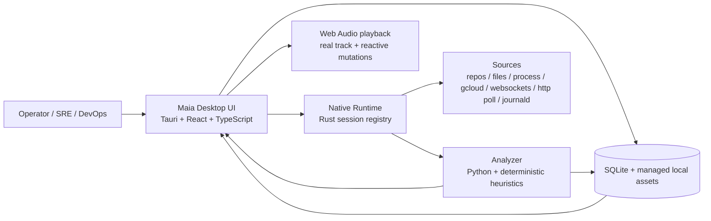
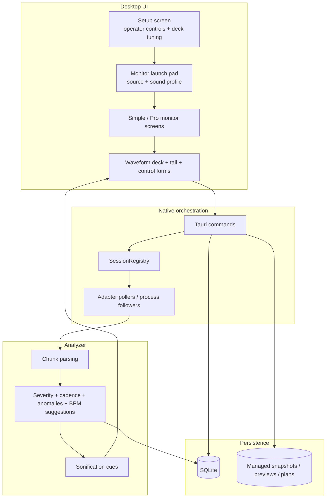
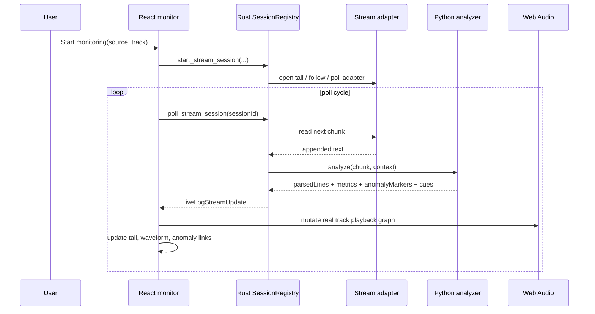
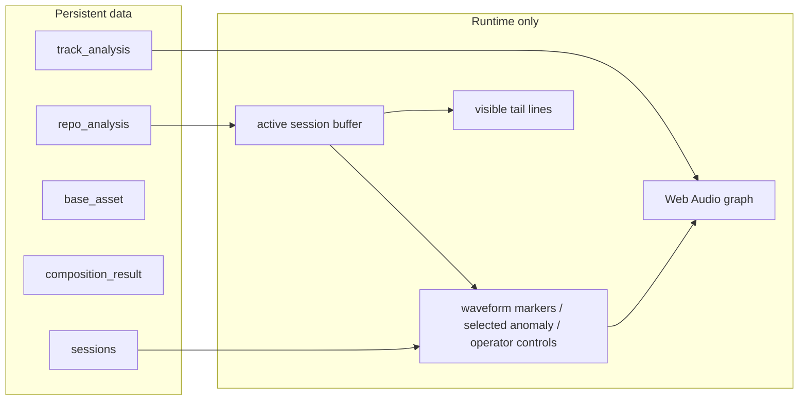
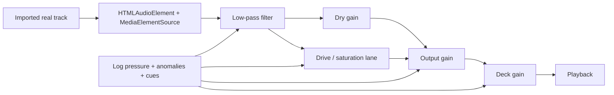
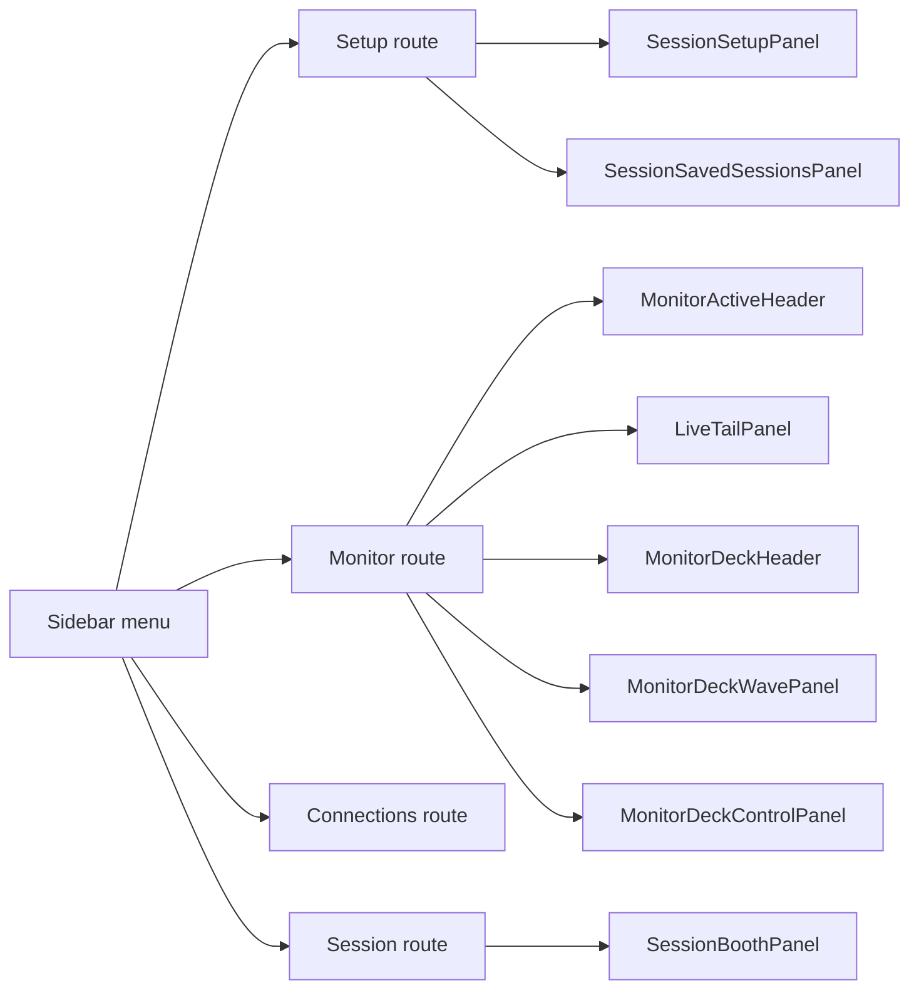

# Architecture

**Last Updated:** June 25, 2026

## Intent
Maia is a local-first desktop product for passive operational monitoring through sound.
The operator selects a real musical track as the listening bed, then Maia parses repositories, tails logs, or follows runtime streams and translates that signal into audible mutations plus DJ-style monitoring visuals.

The MVP goal is not "alerting with sounds". The goal is a stable, recognizable musical base where code and log pressure deform the mix just enough to make drift, bursts, and anomalies perceptible.

## Source Of Truth
- Desktop shell: `desktop/`
- Native runtime and session orchestration: `desktop/src-tauri/`
- Analyzer runtime: `analyzer/src/maia_analyzer/`
- Contracts: `contracts/`
- Product and technical docs: `docs/`

## System Context

## Runtime Layers

## Monitoring Loop
The live monitoring path is intentionally split into three responsibilities:

1. Rust owns session lifecycle and adapter mechanics.
2. Python analyzes each chunk statelessly.
3. React owns visualization, transport of operator state, and Web Audio playback.

## Core Product Model
The MVP keeps the domain intentionally small:

- `track_analysis`: imported tracks and their analysis artifacts
- `repo_analysis`: repository or log-source analysis baseline
- `base_asset`: reusable sound building blocks
- `composition_result`: exported or previewable arrangement result

The important architectural decision is that live monitoring does **not** create a new persisted entity for every stream frame. Runtime monitoring is transient. Persistence stores baselines, sessions, previews, settings, and exportable artifacts.

## Data Ownership

## Stream Adapters
Current MVP-compatible adapters are unified under one session contract:

- `file`
- `process`
- `http-poll`
- `websocket`
- `journald`
- cloud-backed adapters routed through saved connections in the UI

Architecturally, Maia should treat them the same after ingestion: once text enters the session buffer, the analyzer path and monitor deck should behave identically regardless of origin.

## Audio Model
Maia does not synthesize a full song from scratch for monitoring mode.
It starts from a recognizable track and applies controlled deformation.

This keeps the product aligned with the UX promise:

- no toy piano baseline
- real track always present
- anomalies modify texture, filtering, drive, and emphasis
- quiet streams let the track breathe instead of collapsing

## UI Architecture
The main monitor surface is moving toward a modular deck:

- `SimpleMonitorScreen.tsx`: orchestration and runtime wiring
- `MonitorSetupScreen.tsx`: dedicated setup route from the lateral menu
- `ConnectionsScreen.tsx`: persistent cloud/file/process connection management
- `MonitorActiveHeader.tsx`: session identity and state
- `LiveTailPanel.tsx`: tail view with anomaly linking
- `MonitorDeckHeader.tsx`: BPM, time, severity legend
- `MonitorDeckControlPanel.tsx`: operator-editable deck parameters
- `MonitorDeckWavePanel.tsx`: overview + moving waveform deck
- `SessionScreen.tsx`: session route orchestration, now reduced through extracted panels
- `SessionSetupPanel.tsx`: source / sound profile / initialization flow
- `SessionBoothPanel.tsx`: live booth summary and launch state
- `SessionSavedSessionsPanel.tsx`: replayable history lane
- extracted runtime hooks:
  - `useMonitorLiveStream.ts`
  - `useMonitorDeckControls.ts`
- extracted pure logic:
  - `monitorLogParsing.ts`
  - `monitorAudioMutation.ts`
  - `monitorDeckViewModel.ts`
  - `monitorSourceOptions.ts`
  - `monitorSessions.ts`

This split is important because the previous single-file monitor accumulated rendering, parsing, deck math, audio mutation, source selection, and session UI in one place.

## Localization Layer
The desktop UI is converging on a single translation source per string family so screens stop mixing English and Spanish literals.

- `src/i18n/en.ts`: default source language and fallback
- `src/i18n/es.ts`: Spanish locale
- `src/i18n/I18nContext.tsx`: runtime provider / lookup hook

Architectural rule:

- UI components should consume `useT()` instead of embedding visible copy.
- View-model and formatting helpers may receive translated labels as parameters when they need to compose operator-facing text.
- New deck/setup controls should land in both locales during the same change.

## Coverage Snapshot
Coverage was measured on June 25, 2026 with `npm run coverage` inside `desktop/`.

- Global statements: `41.82%`
- Global branches: `61.24%`
- Global functions: `65.6%`
- Global lines: `41.82%`
- Strongest area today:
  - extracted support modules such as `monitorDeckViewModel.ts`, `monitorAudioMutation.ts`, `monitorLogParsing.ts`, and `monitorSourceOptions.ts`
  - session support modules such as `sessionBoothViewModel.ts` and `sourceTemplates.ts`
  - analyzer-side panels with focused interactions such as `TrackPerformancePanel.tsx` and `BeatGridEditorPanel.tsx`
- Weakest area today:
  - app shell / route composition such as `App.tsx`, `App-v0.tsx`, and `AppShell.tsx`
  - large screen containers such as `ConnectionsScreen.tsx`, `MonitorSetupScreen.tsx`, and `SimpleMonitorScreen.tsx`
  - stateful hooks and provider-heavy flows such as `MonitorContext.tsx`, `useLibrary.ts`, and `useSessions.ts`

## Operator-Tunable Parameters
The monitor now treats key experience parameters as operator-editable controls rather than hidden constants.

Current editable deck controls:

- waveform zoom
- reactive mix
- anomaly emphasis
- idle motion
- cue cooldown
- beat snap subdivision

These are UI/runtime controls, not analyzer contracts. They tune how Maia presents and reacts to incoming operational signal without changing the underlying parsed evidence.

## Design Constraint
This must feel like a DJ deck, not a dashboard.

That means:

- the waveform is a transport surface, not just a graph
- the log tail is linked to audible and visual anomalies
- controls should feel like deck parameters, not admin settings
- the real track remains legible as the primary listening object

## Current Risks
- Overall desktop test coverage is still low outside the extracted monitor modules.
- The monitor screen still owns too much hook-level orchestration.
- Connection-backed monitoring needs stronger end-to-end integration coverage, especially for cloud backfill and long-running polling behavior.
- Full build and full-app coverage remain weaker than the local monitor-focused suite.
- Some large screens are now partially decomposed, but the next maintainability win depends on moving more logic out of route components and into tested view-model/helpers.

## Next Refactor Targets
1. Add integration tests around connection-backed monitoring, tail updates, and cloud backfill windows.
2. Continue reducing `SimpleMonitorScreen.tsx` by isolating canvas interaction, scrub logic, and active-session composition.
3. Move operator customization into a dedicated setup/customization route and persist typed deck settings so behavior survives app restarts.
4. Add setup-route coverage for source selection, sound profile selection, and connection-backed launch flows.
5. Expand locale-aware tests so UI copy regressions are caught without relying on brittle literal snapshots.
