# Frontend Architecture

This document describes the active desktop frontend as it exists today.
It complements:

- [docs/architecture.md](architecture.md) for product-level architecture
- [docs/open-source-maintainer-guide.md](open-source-maintainer-guide.md) for cross-runtime maintainer context

## Active shell

The mounted desktop path is:

1. `desktop/src/main.tsx`
2. `MonitorProvider`
3. `App-v0.tsx`

`desktop/src/App.tsx` still exists as the legacy expert/simple shell and now delegates
section routing to `desktop/src/AppSectionContent.tsx` plus
`desktop/src/appSectionContentRuntime.ts`. It is not the mounted shell today, but it remains
an important compatibility path and test target.

Its shell-level visual responsibilities are now also split across:

- `desktop/src/components/AppTopbar.tsx`
- `desktop/src/components/AppMonitorOverview.tsx`
- `desktop/src/appShellRuntime.ts`
- `desktop/src/AppCurateSection.tsx`
- `desktop/src/AppSessionSection.tsx`

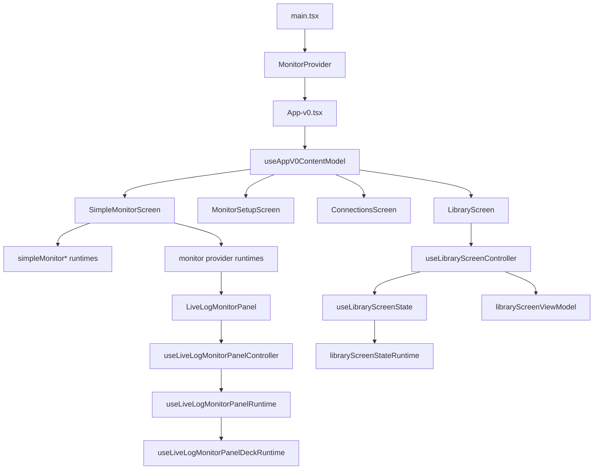

## Refactor status

The original high-risk areas were:

- one oversized mounted shell
- one oversized simple monitor screen
- mixed routing, mutation, and monitor startup logic
- setup preferences mixed into live operator panels

The current state is materially better:

- `App-v0.tsx` is now a thin mounted shell
- section selection and shell composition are routed through dedicated view-model/runtime helpers
- monitor startup is routed through `appV0MonitorOrchestration.ts` and `appV0MonitorRuntime.ts`
- monitor startup now uses an explicit runtime seam in `appV0MonitorOrchestrationRuntime.ts`, so the public orchestrator is mostly wiring
- monitor screen composition is now delegated to smaller screen and deck modules
- preferences and setup live in dedicated routes instead of being mixed into the live deck

This does not mean the frontend is "finished". It means the main contributor risk moved away from
single-file UI edits and toward explicit orchestration/runtime contracts, which is healthier for an
open-source codebase.

## Frontend responsibilities

The frontend owns:

- screen composition
- user flows for monitor, setup, connections, and library
- Web Audio playback and mutation
- transient view state
- browser/mock fallbacks around native commands

The frontend does **not** own:

- SQLite persistence
- filesystem access
- long-lived native stream sessions
- analyzer execution internals

## Current architectural direction

Recent refactors have been pushing large components toward:

- pure view-models for display state
- pure runtimes for monitor/orchestration behavior
- thinner screen components
- better testability around monitor startup, setup preferences, shell state, and stream mutation logic
- locale composition by domain section instead of monolithic translation files

Current emphasis for the next iterations:

- keep monitor-specific contracts inside `types/monitor.ts`
- keep cross-screen monitor launch contracts in `types/monitorLaunch.ts` instead of feature-local UI folders
- isolate orchestration from screen rendering
- keep setup/preferences as a dedicated product surface, not mixed into live operations
- make the open-source entrypoints understandable for first-time contributors
- keep audio control shells thin by routing managed-player and live-monitor DSP behavior through focused runtimes/hooks
- keep shared utility surfaces split by domain concern, instead of letting formatting, timing, and mutation logic accumulate in one helper file
- keep translation contracts independent from concrete locale files; `desktop/src/i18n/types.ts` is now the stable typing seam so future locale/domain splits do not require app-wide import churn

## Translation architecture

The i18n layer is now intentionally split into:

- `desktop/src/i18n/types.ts` for the shared translation contract
- `desktop/src/i18n/locales/enLocale.ts` and `desktop/src/i18n/locales/esLocale.ts` for locale composition
- `desktop/src/i18n/locales/<locale>/` for domain slices such as `core`, `library`, `inspect`, `compose`, `session`, `controls`, and `appShell`

This keeps locale review diff-friendly and avoids mixing monitor copy, setup copy, connection copy, and library copy inside one giant file.

## Orchestration boundaries

The current frontend architecture aims to keep five concerns separate:

1. shell composition
2. section routing
3. monitor launch orchestration
4. live monitor runtime
5. pure display derivation

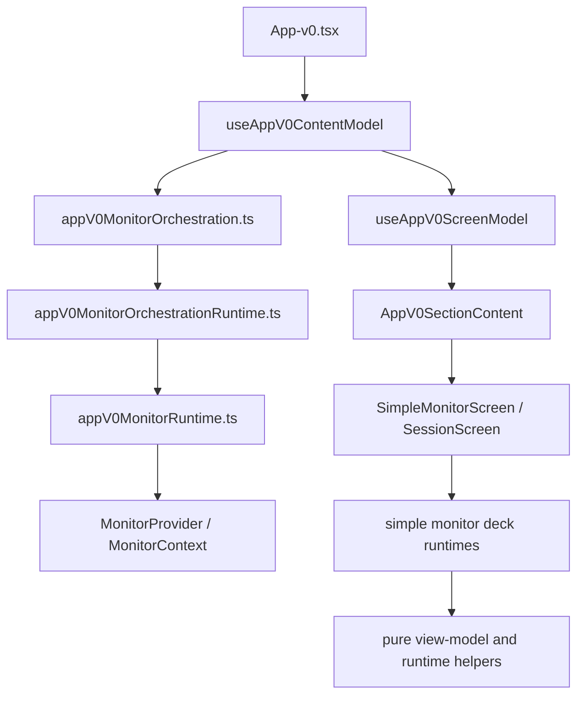

Practical rule for contributors:

- if you are deciding what to render, prefer a view-model/runtime helper
- if you are deciding how to start, attach, replay, or stop monitoring, prefer orchestration helpers
- if the logic is not UI-specific, keep launch-source contracts in `types/monitorLaunch.ts` rather than in `features/simple`
- if you are deciding how live audio or waveforms mutate, stay inside monitor runtimes
- if you need persistence or adapter behavior, do not re-implement it in React; push that concern to the existing native/api contract

## Monitor launch flow

The most important interactive path for the product is the passive monitor launch flow.

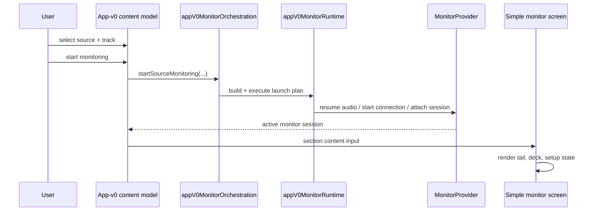

This is the path new contributors should understand before touching:

- saved connections
- cloud stream startup
- monitor setup defaults
- session replay
- active deck visuals

## Simple monitor architecture

The simple monitor route should now be read as a composed product surface rather than a single component.

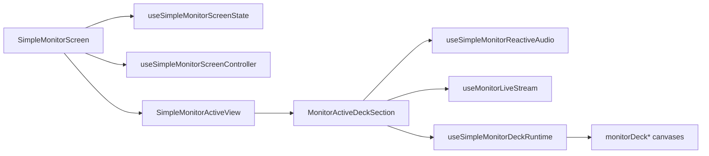

The intent is:

- `Screen`: wiring, route-level state, setup
- `ActiveView`: live-monitor layout composition
- `Deck`: deck-focused composition
- `Audio` and `Stream`: side-effectful runtimes
- `Canvases`: drawing only

Inside the provider/runtime layer, the monitor flow is now also intentionally split:

- `monitorSessionRuntime.ts` is only the public seam; session factories and poll-cycle logic now live in dedicated runtimes
- `monitorProviderPlaybackSessionRuntime.ts` is only the playback-session entrypoint; bootstrap and shared contracts now live in dedicated runtimes
- `monitorProviderSessionActionRuntime.ts` is only the provider-action seam; builder and effect concerns now live in dedicated runtimes
- `monitorReplayTickRuntime.ts` is only the replay-tick seam; replay event dispatch and replay run-loop logic now live in dedicated runtimes
- `monitorReplayRuntime.ts` is only the replay helper seam; telemetry, event/update mapping, and source rebuild concerns now live in dedicated runtimes
- `monitorProviderOrchestrationRuntime.ts` is a façade over replay, audio-resume, and state-update runtimes

The analyzer-side live deck follows the same direction:

- `liveLogMonitorAudioRuntime.ts` is now a public facade over focused mutation, blob-audio, and source-resolution runtimes
- `useManagedAudioPlayerController.ts` now composes dedicated blob-source and cue-sync hooks instead of embedding the full playback state machine inline
- `useLiveLogMonitorBackgroundAudioEngine.ts` now composes dedicated background-bus and background-mutation hooks instead of embedding node wiring plus mutation automation in one hook
- `liveLogMonitorPanelViewModelRuntime.ts` and `liveLogMonitorPanelViewModel.ts` now both act as public facades over smaller status/playlist/types/builder runtimes
- `useLiveLogMonitorBackgroundDeckControl.ts` now shares fade-out, deck-snapshot, and warning-capping logic through a focused runtime instead of keeping those concerns inline in the hook
- `useLiveLogMonitorBackgroundDeckControl.ts` now also routes background-deck start orchestration and transition timer arming through focused controller/start/timer runtimes
- `useManagedAudioPlayerController.ts` now routes transport interactions and derived player HUD state through `managedAudioPlayerControllerRuntime.ts`
- `useWaveformPlaceholderViewModel.ts` now acts as a thin composition seam over `useWaveformPlaceholderInteractions.ts` plus `waveformPlaceholderViewModelRuntime.ts`, keeping waveform display derivation out of the React hook body
- `useMonitorLiveStream.ts` now routes local state/refs/simulated bursts through `useMonitorLiveStreamControllerState.ts`, so the live stream hook stays focused on lifecycle/subscription/idle orchestration
- `useWaveformPlaceholderInteractions.ts` now routes drag/toggle state mutations through `waveformPlaceholderInteractionActionRuntime.ts` and capability resets through `useWaveformPlaceholderInteractionResets.ts`, reducing another mixed refs/setters block in the waveform editor flow
- `useWaveformPlaceholderInteractions.ts` now also routes its callback bundle through `useWaveformPlaceholderInteractionActions.ts`, so the public interaction hook stays closer to state/effect composition while click, drag, and armed-mode handlers stay isolated
- `useWaveformPlaceholderInteractions.ts` now also routes local state/ref bootstrap through `useWaveformPlaceholderInteractionState.ts` and shares its public hook contract through `useWaveformPlaceholderInteractionsTypes.ts`, so the interaction hook stays focused on composing resets, drag effects, and callback runtimes
- `useWaveformPlaceholderInteractionActions.ts` now acts as a thin facade over `useWaveformPlaceholderPrimaryActions.ts`, `useWaveformPlaceholderDragActions.ts`, and shared interaction-action types, so waveform seek/armed-mode handlers and cue/loop drag handlers can evolve independently behind the public callback seam
- `useMonitorProviderRuntimeOrchestration.ts` is now a thin facade over dedicated polling, replay, and audio/live-start sub-hooks, so provider orchestration responsibilities are split by runtime concern instead of sharing one large callback file
- `useMonitorProviderSessionOrchestration.ts` now delegates provider-state/transport/session-api input shaping to `monitorProviderSessionOrchestrationRuntime.ts`, keeping the hook focused on composing runtime orchestration with session actions instead of rebuilding both dependency graphs inline
- `useMonitorProviderControllerActions.ts` now delegates guide-track/session-orchestration input shaping plus grouped public action output to `monitorProviderControllerActionsRuntime.ts`, making the provider controller layer more explicit for contributors who need to trace monitor startup behavior
- `useMonitorLiveStream.ts` now routes option-to-controller shaping through `monitorLiveStreamHookRuntime.ts` and the three live runtime effects through `useMonitorLiveStreamRuntimeEffects.ts`, leaving the public live-stream hook mostly declarative
- `useMonitorProviderReplayRuntime.ts` now acts as a thin replay facade over `useMonitorProviderReplayTelemetryRuntime.ts` and `useMonitorProviderReplayPlaybackRuntime.ts`, so replay telemetry sync and replay tick/dispatch orchestration can evolve independently behind the provider seam
- `useMonitorProviderReplayPlaybackRuntime.ts` now also routes replay-dispatch and replay-tick hook input assembly through `monitorProviderReplayPlaybackHookRuntime.ts` plus shared replay-playback types, keeping the hook closer to a wiring seam and giving replay playback direct focused coverage
- `LiveLogMonitorSetupSection.tsx` now routes workflow/playlist/launch prop assembly through `liveLogMonitorSetupSectionRuntime.ts`, keeping the React section closer to shell composition while setup copy and action wiring stay directly testable
- `liveLogMonitorSetupSectionRuntime.ts` now acts as a stable facade over dedicated workflow, shared-type, base-playlist, and launch-panel runtimes, so setup deck wiring can evolve without re-growing one mixed analyzer setup file
- `useManagedAudioPlayerBlobSource.ts` now routes reset/availability/cleanup decisions through `managedAudioPlayerBlobLifecycleRuntime.ts`, leaving the blob-source effect focused on async byte loading and DOM audio binding
- `useManagedAudioPlayerBlobSource.ts` now also routes blob byte loading, DOM-audio binding, and failure normalization through `managedAudioPlayerBlobEffectRuntime.ts`, so the hook stays closer to lifecycle wiring while the load path remains directly testable
- `useManagedAudioPlayerBlobSource.ts` now also routes availability-state branching and native byte-read delegation through `managedAudioPlayerBlobHookRuntime.ts`, leaving the public hook closer to a lifecycle seam instead of mixing idle/unavailable/native-read branches inline
- `useManagedAudioPlayerBlobSource.ts` now also shares its public hook contract through `useManagedAudioPlayerBlobSourceTypes.ts` and routes async blob-read kickoff through `managedAudioPlayerBlobLoadRuntime.ts`, leaving the hook closer to lifecycle composition while the actual load pipeline stays directly testable
- `monitorWaveformBarRuntime.ts` now acts as a stable facade over dedicated metrics, HUD, canvas, and shared type runtimes, so the passive monitor strip can evolve without mixing signal derivation, tail ingestion, and canvas painting in one file
- `trackEditing.ts` now acts as a compatibility facade over `trackTiming.ts` and `trackPerformanceEditing.ts`, so cue/loop mutation logic no longer lives in the same module as track-time formatting and beat-grid placement helpers
- `ImportBaseAssetForm.tsx` now routes picker, validation, payload normalization, and reset behavior through `useImportBaseAssetFormController.ts` plus `importBaseAssetFormRuntime.ts`, so the library form surface is closer to declarative layout than async workflow orchestration
- `ImportCompositionForm.tsx` now routes selection validity, base-mode fallback, submit validation, and reset behavior through `useImportCompositionFormController.ts` plus `importCompositionFormRuntime.ts`, reducing another mixed library workflow component
- `TrackPerformanceCueLoopSection.tsx` now delegates status, primary cue/loop controls, and phrase actions to dedicated presentational subcomponents, keeping the section closer to a view-model orchestrator instead of one long mixed JSX block
- `MonitorWaveformBar.tsx` now delegates live header/chip/guide-track controls, tail HUD rendering, and subscription/canvas orchestration to dedicated presentational components plus `useMonitorWaveformBarController.ts`, keeping the monitor strip closer to a shell instead of mixing waveform runtime, deck chrome, and monitor effect wiring in one file
- `App.tsx` now delegates shell composition and prop wiring to `AppContentShell.tsx` plus `appShellPropsRuntime.ts`, keeping the app root closer to provider/bootstrap composition instead of mixing shell layout with `AppSectionContent` prop assembly
- `InspectTrackView.tsx` now routes local waveform/compare audition/tab state and patch-producing handlers through `useInspectTrackViewController.ts`, so the inspect deck shell no longer mixes React state lifecycle with every beat-grid/performance mutation callback inline
- `WaveformRegionOverlay.tsx` now delegates region rendering plus keyboard/drag interaction decisions to dedicated presentational components and `waveformRegionOverlayInteractionRuntime.ts`, keeping the overlay closer to a view-model shell instead of mixing CSS placement, key nudging, click suppression, and drag input shaping in one file
- `LiveLogMonitorLaunchPanel.tsx` now delegates feed selection and scene-launch/readiness UI to dedicated subcards plus shared launch-panel types, keeping the passive-monitor setup surface closer to a shell instead of one mixed adapter/style/readiness/CTA block
- `useSimpleMonitorDeckController.ts` now delegates internal deck/runtime slice composition to `useSimpleMonitorDeckControllerSlices.ts`, keeping the public simple-monitor deck hook closer to a facade while playback, live stream, presentation, and deck-control orchestration remain grouped behind one dedicated seam
- `simpleMonitorDeckControllerRuntime.ts` is now only the stable public seam; controller model derivation, live-controller input shaping, presentation input shaping, and hook-state assembly each live in focused runtimes
- `simpleMonitorDeckControllerHookRuntime.ts` is now also only a public seam; runtime passthrough, controller model args, live hook args, presentation hook args, and hook-result assembly now live in focused helper runtimes
- `MonitorDeckWavePanel.tsx` now acts as a visual shell over `MonitorDeckOverviewPanel.tsx`, `MonitorDeckWaveStage.tsx`, and shared panel types, keeping overview/anomaly rendering separate from stage/timeline markup
- `MonitorSetupPanel.tsx` now acts as a setup shell over `MonitorSetupHero.tsx`, `MonitorSetupSourceFilterBar.tsx`, and `MonitorSetupTrackPreviewAction.tsx`, keeping launch CTA, source filtering, and track preview controls out of one mixed JSX block
- `ProMonitorScreen.tsx` now acts as a route shell over `ProMonitorLeftColumn.tsx`, `ProMonitorRightColumn.tsx`, and `ProMonitorPlaybackControls.tsx`, keeping demo playback, log stream, metrics, and bookmarks separated by panel concern
- `monitorSetupDeckMetricsRuntime.ts` now acts as a public seam over `monitorSetupDeckMetricFormatRuntime.ts` and `monitorSetupDeckMetricCardsRuntime.ts`, splitting setup value formatting from setup card/meter derivation
- `useConnectionsFormController.ts` now delegates local state bootstrap to `useConnectionsFormLocalState.ts` and async repository-side effects to `useConnectionsFormActions.ts`, leaving the public connections hook closer to a composition seam
- `useSimpleMonitorDeckLiveController.ts` now delegates refs/reactive-audio/track-audio/live-stream composition to `useSimpleMonitorDeckLiveControllerSlices.ts`, keeping the public live-controller hook closer to a facade while background audio and live stream wiring stay grouped behind a single testable seam
- `LiveTailPanel.tsx` now acts as a small container over `LiveTailPanelHeader.tsx`, `LiveTailPanelEmptyState.tsx`, and `LiveTailPanelLines.tsx`, keeping tail chrome, idle/loading feedback, and anomaly-row rendering isolated behind the same public panel contract
- `ConnectionsFormPanel.tsx` now acts as a form shell over `ConnectionsKindSelector.tsx`, `ConnectionsFileFields.tsx`, `ConnectionsCloudFields.tsx`, and `ConnectionsFormActions.tsx`, so connection-type selection, provider-specific fields, and save/cancel controls evolve independently behind the existing form contract
- `ConnectionsSavedRow.tsx` now delegates row content and row actions to `ConnectionsSavedRowBody.tsx` and `ConnectionsSavedRowActions.tsx`, with status-chip styling isolated in `connectionsSavedRowRuntime.ts`, so the saved-connections surface no longer mixes selection semantics with every tail/test/delete control
- `ConnectionsSavedListPanel.tsx` now acts as a shell over `ConnectionsSavedListState.tsx`, `ConnectionsRefreshButton.tsx`, and `ConnectionsTailConsole.tsx`, keeping loading/empty/list rendering separate from panel chrome and refresh orchestration
- `SessionBoothPanel.tsx` now acts as a layout shell over `SessionBoothHeader.tsx`, `SessionBoothProgress.tsx`, and `SessionBoothDetailGrid.tsx`, so booth chrome, progress feedback, and detail cards no longer share one mixed panel component
- `sessionStartPlanRuntime.ts` now focuses only on assembling start/resume plans, while replay status helpers live in `sessionReplayRuntime.ts`, display/readiness helpers live in `sessionStartPlanDisplayRuntime.ts`, and shared plan types live in `sessionStartPlanTypes.ts`
- `sessionScreenControllerHookRuntime.ts` now acts as a facade over dedicated monitor, actions, derived-hook, and booth/effects runtimes, so the controller seam documents orchestration concerns without re-growing into one mixed builder file
- `OnboardingWizard.tsx` now acts as a small state shell over `onboardingWizardRuntime.ts` plus dedicated step components for source selection, preset selection, summary, and step indicators, keeping wizard copy/layout changes isolated from step-state transitions
- `SimpleModeLibraryView.tsx` now acts as a shell over dedicated library header, repository-section/list, and track-section components, keeping import/start-monitoring controls and track-preview rendering isolated from the view-level state wiring
- `ProLibraryScreen.tsx` now acts as a shell over dedicated tabs, sounds, sources, and profiles sections, with status-badge rendering isolated in `proLibraryScreenRuntime.tsx`, so the pro library surface no longer mixes tab chrome with every list layout
- `monitorDeckScrubControllerRuntime.ts` now acts as a facade over dedicated seek, window-pointer, interaction, and shared-types runtimes, so scrub orchestration for the passive deck no longer accumulates pointer math, viewport math, and anomaly-focus behavior in one file
- `useMonitorTrackBackgroundAudio.ts` now composes dedicated reset, progress-loop, and background-binding subhooks, keeping monitor bed lifecycle concerns separate from the public track-audio hook seam
- `monitorLiveStreamSignalRuntime.ts` now acts as a facade over dedicated signal-buffer types, cue-accent gating, and buffer-advance runtimes, so passive stream signal shaping is split by concern instead of accumulating signal math in one file
- `monitorLiveStreamOrchestrationRuntime.ts` now acts as a facade over dedicated update-state, idle-state, and simulated-state runtimes, so passive stream orchestration no longer mixes normalized update application with idle motion and synthetic tail generation
- `monitorLiveStreamControllerInputRuntime.ts` now acts as a facade over dedicated lifecycle, subscription, and idle-motion input builders, so live-stream controller wiring is split by orchestration concern instead of one broad input-shaping file
- `LiveSonificationScenePanel.tsx` now delegates scene selectors, scene metrics, and route cards to dedicated presentational components, keeping the analyzer-side scene panel closer to a shell instead of one long JSX block mixing selection, summary, and route rendering
- `LiveLogMonitorActivityPanel.tsx` now delegates wave/tail activity, anomaly markers, and synchronized parsed-line lists to dedicated presentational components plus `liveLogMonitorActivityPanelViewRuntime.ts`, keeping passive-monitor activity rendering closer to a shell instead of mixing cue styling, anomaly chips, and synchronized tail layout in one component
- `LiveLogMonitorPerformanceSummary.tsx` now delegates arrangement lanes, recent cues, anomaly marker lists, and monitor notes to dedicated presentational components plus `liveLogMonitorPerformanceSummaryRuntime.ts`, keeping analyzer performance summary rendering closer to a shell instead of one long component mixing section framing with lane grouping and note/error rendering
- `LiveMonitorReplayBookmarksCard.tsx` now delegates replay bookmark form and bookmark list rendering to dedicated presentational components plus `liveMonitorReplayBookmarksCardRuntime.ts`, keeping replay-note UX closer to a shell instead of mixing draft controls, saved-window CTA labels, and bookmark list actions in one card
- `useSessionScreenController.ts` now delegates action/derived-state/effect/booth composition to `useSessionScreenControllerSlices.ts`, keeping the public session controller hook closer to a facade while session startup, monitor subscription wiring, replay recommendation, and booth view-model composition stay grouped behind one explicit seam
- `SessionBoothPanel.tsx` now delegates route/source summary and booth stat rendering to `SessionBoothRouteGrid.tsx` and `SessionBoothStatsGrid.tsx`, keeping the live-session booth panel closer to layout composition instead of mixing CTA chrome with route/status rendering
- `sessionStartPlanRuntime.ts` now delegates session-source validation/resume resolution to `sessionStartPlanSourceRuntime.ts` and session-input/draft assembly to `sessionStartPlanInputRuntime.ts`, keeping the session launch runtime closer to orchestration instead of mixing validation, entity lookup, and `StartSessionInput` shaping in one file
- `SessionSetupSelectionGrid.tsx` now delegates base selection and source selection to `SessionSetupBaseSelectionCard.tsx` and `SessionSetupSourceSelectionCard.tsx`, keeping the session setup grid closer to composition instead of mixing both setup surfaces in one long JSX block
- `SessionSavedSessionsPanel.tsx` now delegates loading/empty/list rendering to `SessionSavedSessionsList.tsx` and shared session-card item shaping to `sessionSavedSessionsPanelRuntime.ts`, keeping the saved-sessions panel closer to composition instead of mixing branchy list state and per-card active/playback derivation inline
- `useSimpleMonitorScreenController.ts` now delegates launch/deck/anomaly orchestration to `useSimpleMonitorScreenControllerSlices.ts`, keeping the public simple-monitor controller hook closer to a facade while monitor launch state, deck runtime wiring, and anomaly filter state stay grouped behind one explicit seam
- `useMonitorLiveStream.ts` now delegates controller-state plus runtime-effect composition to `useMonitorLiveStreamSlices.ts`, keeping the public live-stream hook closer to a facade while state, refs, and stream effect orchestration remain grouped behind a single testable seam
- `useSimpleMonitorReactiveAudio.ts` now delegates ref/handler composition to `useSimpleMonitorReactiveAudioSlices.ts`, keeping the public reactive-audio hook closer to a facade while graph initialization, cue/test-tone playback, and mutation-application wiring stay grouped behind one testable seam
- `PadSequencerPanel.tsx` now delegates sequencer state/timer orchestration to `usePadSequencerController.ts` and splits header/grid rendering into dedicated presentational components, keeping the panel closer to a shell instead of mixing playhead timing, grid mutation, and step rendering in one file
- `useLiveLogMonitorBackgroundDeckControl.ts` now delegates stop/start state application to `liveLogMonitorBackgroundDeckActionsRuntime.ts`, keeping the hook closer to effect wiring while background deck presentation state remains directly testable outside React
- `useLiveLogMonitorBackgroundDeckControl.ts` now also routes timer cleanup, cached buffer loading, and controller-input assembly through `liveLogMonitorBackgroundDeckHookRuntime.ts` plus `useLiveLogMonitorBackgroundDeckControlTypes.ts`, keeping the public hook closer to a wiring seam
- `useLiveLogMonitorBackgroundDeckControl.ts` now also delegates its `useEffectEvent` handler bundle to `useLiveLogMonitorBackgroundDeckEventHandlers.ts`, so the public hook stays focused on transition-timer wiring while background stop/start/schedule behavior remains isolated behind the existing deck runtimes
- `waveformPlaceholderViewModelRuntime.ts` now acts as a small facade over dedicated derived-state, visual-state, and shared-type runtimes, so waveform summary/overlay assembly can evolve without re-growing one mixed display builder
- `useLiveLogMonitorBackgroundMutation.ts` now delegates active-target resolution, forced-state gating, and resolved mutation application to `liveLogMonitorBackgroundMutationEffectRuntime.ts`, so the hook stays focused on React effect wiring while background mutation automation remains directly testable
- `liveLogMonitorPanelStatusStateRuntime.ts` now acts as a smaller facade over shared status-state types plus a dedicated metric-grid runtime, so panel HUD assembly can evolve without mixing public contracts and metric-label wiring in one file
- `monitorStartupRuntime.ts` now acts as a stable monitor-startup facade over dedicated source-template, guide-track queue, guide-track load, and shared-type runtimes, so monitor boot behavior can evolve without regrowing one mixed startup file
- `ImportRepositoryForm.tsx` now routes submit normalization, Cloud Run payload derivation, field-reset policy, and source-path copy selection through `importRepositoryFormRuntime.ts`, so the repository/log-source intake UI keeps its public surface while domain rules stay directly testable outside React
- `ImportRepositoryForm.tsx` now also delegates source-mode cards, dynamic source fields, and submit/footer actions to dedicated presentational components, so the form shell stays focused on local state, picker flows, and submission wiring
- `ImportRepositoryForm.tsx` now also delegates local browse/import/reset orchestration to `useImportRepositoryFormController.ts`, so the JSX shell stays focused on translation and layout while file/cloud intake flows remain directly testable outside the component
- `useImportRepositoryFormController.ts` now composes `useImportRepositoryFormDraftState.ts`, keeping draft/local source selection state separate from async picker/import side effects
- `useImportRepositoryFormController.ts` now also delegates async submit and picker branches to `importRepositoryFormControllerRuntime.ts`, so import validation/persistence rules stay directly testable outside the hook
- `ImportRepositorySourceFields.tsx` now delegates Cloud Run and local source-path rows to dedicated presentational components, keeping the field switch smaller and clearer for future source-type additions
- `playlistTransition.ts` now acts as a stable facade over dedicated mix, entry, delay, shared-metric, and shared-type runtimes, so transition planning can evolve without keeping harmonic matching, cue selection, phrase alignment, and delay alignment concentrated in one utility file
- `playlistTransitionMixRuntime.ts` now delegates harmonic/tempo resolution to `playlistTransitionHarmonyRuntime.ts` and delta/mode/crossfade derivation to `playlistTransitionPlanRuntime.ts`, so mix planning can evolve without concentrating musical compatibility and mode-selection rules in one file
- `playlistTransitionHarmonyRuntime.ts` now acts as a tiny facade over dedicated key-compatibility and tempo-correction runtimes, so Camelot/key parsing and BPM correction can evolve independently behind the playlist transition seam
- `playlistTransitionKeyRuntime.ts` now acts as a tiny public facade over dedicated parsing and compatibility runtimes, so notation normalization and Camelot compatibility scoring can evolve independently behind the harmonic-label seam
- `monitorGuideTrackLoadRuntime.ts` now acts as a stable facade over dedicated guide-track state and load-effect runtimes, so monitor boot can evolve without mixing fade-out/reset state, decode acceptance/rejection, and async load orchestration in one file
- `monitorGuideTrackLoadEffectRuntime.ts` now delegates decoded-guide-track success/error resolution to `monitorGuideTrackLoadResolutionRuntime.ts`, so the async load effect stays focused on lifecycle orchestration while decode-result state transitions remain directly testable
- `monitorGuideTrackLoadResolutionRuntime.ts` now delegates ready/superseded/failed/ignored outcome formatting to `monitorGuideTrackLoadOutcomeRuntime.ts`, so state mutation and logging policy can evolve independently inside the guide-track decode path
- `monitorGuideTrackLoadEffectRuntime.ts` now also delegates the decode promise chain to `monitorGuideTrackLoadPromiseRuntime.ts`, so async decode attachment and success/failure callback routing can evolve independently from the startup state machine
- `monitorGuideTrackDecodeRuntime.ts` now acts as a stable facade over dedicated decode types, transport loading, and PCM decoding runtimes, so Tauri/browser byte transport and mono-PCM materialization can evolve independently behind the guide-track decode seam

## Contributor starting points

For new open-source contributors, the recommended reading order is:

1. `desktop/src/main.tsx`
2. `desktop/src/App-v0.tsx`
3. `desktop/src/hooks/useAppV0ContentModel.ts`
4. `desktop/src/hooks/useAppV0ScreenModel.ts`
5. `desktop/src/appV0MonitorOrchestration.ts`
6. `desktop/src/appV0MonitorRuntime.ts`
7. `desktop/src/features/monitor/MonitorContext.tsx`
8. `desktop/src/features/simple/SimpleMonitorScreen.tsx`
9. `desktop/src/features/analyzer/components/LiveLogMonitorPanel.tsx`

After that, choose one branch:

- shell and section routing
- monitor launch and sessions
- live deck visuals and audio
- connections and source management
- library and assets

## Testing posture

The frontend refactor is intentionally backed by runtime-heavy tests.

The current direction is:

- keep hooks and runtimes directly testable
- prefer pure derivation helpers for labels, section composition, and launch planning
- avoid re-growing inline screen logic that cannot be covered without full rendering

When adding features, prefer placing logic where it can be exercised by:

- hook tests
- runtime unit tests
- App-v0 section composition tests
- monitor launch flow integration tests

## Key modules

### Shell and entrypoint

- `desktop/src/App-v0.tsx`
- `desktop/src/hooks/useAppV0ContentModel.ts`
- `desktop/src/AppV0SectionContent.tsx`
- `desktop/src/App.tsx`
- `desktop/src/AppSectionContent.tsx`
- `desktop/src/AppCurateSection.tsx`
- `desktop/src/AppSessionSection.tsx`
- `desktop/src/components/AppTopbar.tsx`
- `desktop/src/components/AppMonitorOverview.tsx`
- `desktop/src/appShellRuntime.ts`
- `desktop/src/hooks/useAppContentController.ts`
- `desktop/src/hooks/appContentControllerRuntime.ts`
- `desktop/src/hooks/useAppContentDomainState.ts`
- `desktop/src/hooks/useAppContentActionBundles.ts`
- `desktop/src/hooks/useAppContentShellState.ts`
- `desktop/src/hooks/useAppContentBootstrap.ts`
- `desktop/src/hooks/useAppContentNavigationActions.ts`
- `desktop/src/hooks/useAppContentSessionEffects.ts`
- `desktop/src/hooks/useAppCatalogActions.ts`
- `desktop/src/hooks/useAppCatalogImportActions.ts`
- `desktop/src/hooks/appCatalogImportActionsRuntime.ts`
- `desktop/src/hooks/useAppCatalogLibraryActions.ts`
- `desktop/src/hooks/appCatalogLibraryActionsRuntime.ts`
- `desktop/src/hooks/appCatalogActionsRuntime.ts`
- `desktop/src/hooks/appCatalogActionsTypes.ts`
- `desktop/src/hooks/useAppMonitorActions.ts`
- `desktop/src/hooks/useAppMonitorGuideActions.ts`
- `desktop/src/hooks/appMonitorGuideActionsRuntime.ts`
- `desktop/src/hooks/useAppMonitorSessionActions.ts`
- `desktop/src/hooks/appMonitorSessionActionsRuntime.ts`
- `desktop/src/hooks/appMonitorActionsTypes.ts`
- `desktop/src/hooks/useAppSelectionActions.ts`
- `desktop/src/appMonitorActionsRuntime.ts`
- `desktop/src/appSectionContentRuntime.ts`
- `desktop/src/hooks/useAppV0ShellState.ts`
- `desktop/src/hooks/useAppV0PreferencesState.ts`
- `desktop/src/hooks/useAppV0PreferencesHydration.ts`
- `desktop/src/hooks/useAppV0PreferencesPersistence.ts`
- `desktop/src/hooks/appV0PreferencesStateRuntime.ts`
- `desktop/src/hooks/useAppV0MonitorScreenState.ts`
- `desktop/src/hooks/appV0ContentModelRuntime.ts`
- `desktop/src/hooks/useAppV0ScreenModel.ts`
- `desktop/src/hooks/appV0MonitorScreenStateRuntime.ts`
- `desktop/src/hooks/useSessions.ts`
- `desktop/src/hooks/useSessionsPersistence.ts`
- `desktop/src/hooks/useSessionBookmarksLoader.ts`
- `desktop/src/hooks/sessionsStateRuntime.ts`
- `desktop/src/appV0MonitorOrchestration.ts`
- `desktop/src/appV0Preferences.ts`
- `desktop/src/appV0MonitorRuntime.ts`
- `desktop/src/appV0SectionViewModel.ts`
- `desktop/src/appV0ShellViewModel.ts`
- `desktop/src/appV0ViewModel.ts`
- `desktop/src/components/waveformBarRuntime.ts`

### Monitor surface

- `desktop/src/features/analyzer/components/LiveLogMonitorPanel.tsx`
- `desktop/src/features/analyzer/components/useLiveLogMonitorPanelController.tsx`
- `desktop/src/features/analyzer/components/useLiveLogMonitorPanelRuntime.tsx`
- `desktop/src/features/analyzer/components/liveLogMonitorPanelRuntimeBridge.ts`
- `desktop/src/features/analyzer/components/useLiveLogMonitorPanelRuntimeState.tsx`
- `desktop/src/features/analyzer/components/liveLogMonitorPanelRuntimeStateBridge.ts`
- `desktop/src/features/analyzer/components/useLiveLogMonitorPanelDeckRuntime.tsx`
- `desktop/src/features/analyzer/components/liveLogMonitorPanelDeckRuntimeBridge.ts`
- `desktop/src/features/analyzer/components/liveLogMonitorPanelDeckCallbacksRuntime.ts`
- `desktop/src/features/analyzer/components/useLiveLogMonitorDeckModel.tsx`
- `desktop/src/features/analyzer/components/liveLogMonitorDeckModelBridge.ts`
- `desktop/src/features/analyzer/components/liveLogMonitorPanelViewModelRuntime.ts`
- `desktop/src/features/analyzer/components/liveLogMonitorPanelRenderStateRuntime.ts`
- `desktop/src/features/analyzer/components/useLiveLogMonitorPanelAudioRuntime.ts`
- `desktop/src/features/analyzer/components/useLiveLogMonitorPanelAudioCore.ts`
- `desktop/src/features/analyzer/components/useLiveLogMonitorPanelAudioEffects.ts`
- `desktop/src/features/analyzer/components/liveLogMonitorPanelAudioInputRuntime.ts`
- `desktop/src/features/analyzer/components/liveLogMonitorPanelAudioTypes.ts`
- `desktop/src/features/analyzer/components/liveLogMonitorPanelAudioFeedbackRuntime.ts`
- `desktop/src/features/analyzer/components/LiveLogMonitorDeckSection.tsx`
- `desktop/src/features/analyzer/components/LiveLogMonitorLiveDeck.tsx`
- `desktop/src/features/analyzer/components/LiveWaveformCanvas.tsx`
- `desktop/src/features/analyzer/components/liveWaveformCanvasRuntime.ts`
- `desktop/src/features/analyzer/components/liveLogMonitorPlaylistEditorRuntime.ts`
- `desktop/src/features/analyzer/components/liveLogMonitorPlaylistViewState.ts`
- `desktop/src/features/analyzer/components/liveLogMonitorViewModelRuntime.ts`
- `desktop/src/features/analyzer/components/liveLogMonitorTrackSelectionRuntime.ts`
- `desktop/src/features/analyzer/components/liveLogMonitorExplanationRuntime.ts`
- `desktop/src/features/analyzer/components/liveLogMonitorAdapterRuntime.ts`
- `desktop/src/features/analyzer/components/liveLogMonitorInteractionRuntime.ts`
- `desktop/src/features/analyzer/components/liveLogMonitorControlRuntime.ts`
- `desktop/src/features/analyzer/components/liveLogMonitorLiveDeckPropsRuntime.ts`
- `desktop/src/features/analyzer/components/liveLogMonitorDeckSectionRuntime.ts`
- `desktop/src/features/analyzer/components/liveLogMonitorDeckSectionContentRuntime.tsx`
- `desktop/src/features/analyzer/components/liveLogMonitorDeckPanelsRuntime.tsx`
- `desktop/src/features/analyzer/components/liveLogMonitorLiveDeckPropsBuilderRuntime.tsx`
- `desktop/src/features/analyzer/components/liveLogMonitorDisplayRuntime.ts`
- `desktop/src/features/analyzer/components/liveLogMonitorDisplayStateRuntime.ts`
- `desktop/src/features/analyzer/components/liveLogMonitorDisplayMetricsRuntime.ts`
- `desktop/src/features/analyzer/components/liveLogMonitorCueEngineDisplayRuntime.ts`
- `desktop/src/features/analyzer/components/liveLogMonitorSessionCardRuntime.ts`
- `desktop/src/features/analyzer/components/liveLogMonitorMetricGridRuntime.ts`
- `desktop/src/features/analyzer/components/liveLogMonitorMetricGridRowsRuntime.ts`
- `desktop/src/features/analyzer/components/liveLogMonitorMetricGridFormatRuntime.ts`
- `desktop/src/features/analyzer/components/liveSonificationSampleSourceRuntime.ts`
- `desktop/src/features/analyzer/components/liveSonificationRouteRuntime.ts`
- `desktop/src/features/analyzer/components/liveSonificationCueRoutingRuntime.ts`
- `desktop/src/features/analyzer/components/liveSonificationSceneResolutionRuntime.ts`
- `desktop/src/features/analyzer/components/liveSonificationSceneSummaryRuntime.ts`
- `desktop/src/features/analyzer/components/liveSonificationSceneProfileData.ts`
- `desktop/src/features/analyzer/components/liveSonificationCategoryProfileData.ts`
- `desktop/src/features/analyzer/components/liveSonificationStrategyProfileData.ts`
- `desktop/src/features/analyzer/components/liveSonificationGenreProfileData.ts`
- `desktop/src/features/analyzer/components/liveSonificationDanceGenreProfileData.ts`
- `desktop/src/features/analyzer/components/liveSonificationHouseGenreProfileData.ts`
- `desktop/src/features/analyzer/components/liveSonificationClubGenreProfileData.ts`
- `desktop/src/features/analyzer/components/liveSonificationAcousticGenreProfileData.ts`
- `desktop/src/features/analyzer/components/liveSonificationSequencerPresetData.ts`
- `desktop/src/features/analyzer/components/compositionPreviewRenderRuntime.ts`
- `desktop/src/features/analyzer/components/compositionPreviewDerivedRenderRuntime.ts`
- `desktop/src/features/analyzer/components/compositionPreviewDerivedStemRuntime.ts`
- `desktop/src/features/analyzer/components/compositionPreviewDerivedStemBaseRuntime.ts`
- `desktop/src/features/analyzer/components/compositionPreviewFoundationStemRuntime.ts`
- `desktop/src/features/analyzer/components/compositionPreviewMotionStemRuntime.ts`
- `desktop/src/features/analyzer/components/compositionPreviewGlueStemRuntime.ts`
- `desktop/src/features/analyzer/components/compositionPreviewDerivedSpotlightStemRuntime.ts`
- `desktop/src/features/analyzer/components/compositionPreviewDerivedAutomationRuntime.ts`
- `desktop/src/features/analyzer/components/compositionPreviewPersistedRenderRuntime.ts`
- `desktop/src/features/analyzer/components/trackPerformancePanelViewRuntime.ts`
- `desktop/src/features/analyzer/components/trackPerformancePanelActionsRuntime.ts`
- `desktop/src/features/analyzer/components/liveLogMonitorAudioCleanupRuntime.ts`
- `desktop/src/features/analyzer/components/liveLogMonitorPreferencesRuntime.ts`
- `desktop/src/features/analyzer/components/liveLogMonitorBackgroundRuntime.ts`
- `desktop/src/features/analyzer/components/liveLogMonitorMutationRuntime.ts`
- `desktop/src/features/analyzer/components/liveLogMonitorCuePlaybackRuntime.ts`
- `desktop/src/features/analyzer/components/liveLogMonitorStreamUpdateRuntime.ts`
- `desktop/src/features/analyzer/components/liveLogMonitorActionRuntime.ts`
- `desktop/src/features/analyzer/components/liveLogMonitorSequencerRuntime.ts`
- `desktop/src/features/analyzer/components/liveLogMonitorCueExecutionRuntime.ts`
- `desktop/src/features/analyzer/components/liveLogMonitorCueScheduleRuntime.ts`
- `desktop/src/features/analyzer/components/liveLogMonitorBeatRuntime.ts`
- `desktop/src/features/analyzer/components/liveLogMonitorUpdateDerivationRuntime.ts`
- `desktop/src/features/analyzer/components/liveLogMonitorSampleRuntime.ts`
- `desktop/src/features/analyzer/components/liveLogMonitorBackgroundDeckRuntime.ts`
- `desktop/src/features/analyzer/components/liveLogMonitorBackgroundDeckTypes.ts`
- `desktop/src/features/analyzer/components/liveLogMonitorBackgroundDeckSnapshotRuntime.ts`
- `desktop/src/features/analyzer/components/liveLogMonitorBackgroundDeckBufferRuntime.ts`
- `desktop/src/features/analyzer/components/liveLogMonitorAudioRuntime.ts`
- `desktop/src/features/analyzer/components/liveLogMonitorPanelRuntime.ts`
- `desktop/src/features/analyzer/components/liveLogMonitorViewModel.ts`
- `desktop/src/features/analyzer/components/TrackCueList.tsx`
- `desktop/src/features/analyzer/components/TrackSavedLoopList.tsx`
- `desktop/src/features/analyzer/components/useLiveLogMonitorResetActions.ts`
- `desktop/src/features/analyzer/components/useLiveLogMonitorBackgroundLifecycle.ts`
- `desktop/src/features/analyzer/components/useLiveLogMonitorBackgroundDeckControl.ts`
- `desktop/src/features/analyzer/components/useLiveLogMonitorAudioBootstrap.ts`
- `desktop/src/features/analyzer/components/useLiveLogMonitorBackgroundAudioEngine.ts`
- `desktop/src/features/analyzer/components/useLiveLogMonitorAuxPlayback.ts`
- `desktop/src/features/analyzer/components/useLiveLogMonitorSampleBank.ts`
- `desktop/src/features/analyzer/components/useLiveLogMonitorSurfaceSync.ts`
- `desktop/src/features/simple/SimpleMonitorScreen.tsx`
- `desktop/src/features/simple/SimpleMonitorActiveView.tsx`
- `desktop/src/features/simple/ConnectionsScreen.tsx`
- `desktop/src/features/simple/ConnectionsHeroPanel.tsx`
- `desktop/src/features/simple/MonitorActiveDeckSection.tsx`
- `desktop/src/features/simple/MonitorActiveFooter.tsx`
- `desktop/src/features/simple/MonitorDeckHeader.tsx`
- `desktop/src/features/simple/monitorDeckHeaderRuntime.ts`
- `desktop/src/features/simple/simpleMonitorActiveViewRuntime.ts`
- `desktop/src/features/simple/useSimpleMonitorScreenState.ts`
- `desktop/src/features/simple/useSimpleMonitorScreenController.ts`
- `desktop/src/features/simple/useSimpleMonitorAnomalyFilterState.ts`
- `desktop/src/features/simple/useConnectionsFormController.ts`
- `desktop/src/features/simple/simpleMonitorScreenOrchestrationRuntime.ts`
- `desktop/src/features/simple/simpleMonitorScreenHookArgsRuntime.ts`
- `desktop/src/features/simple/simpleMonitorScreenSectionsRuntime.ts`
- `desktop/src/features/simple/simpleMonitorScreenStateRuntime.ts`
- `desktop/src/features/simple/simpleMonitorScreenSlicesRuntime.ts`
- `desktop/src/features/simple/useSimpleMonitorDeckRuntime.ts`
- `desktop/src/features/simple/useSimpleMonitorDeckController.ts`
- `desktop/src/features/simple/useSimpleMonitorDeckLiveController.ts`
- `desktop/src/features/simple/simpleMonitorDeckRuntimeTypes.ts`
- `desktop/src/features/simple/simpleMonitorDeckRuntime.ts`
- `desktop/src/features/simple/useSimpleMonitorSourceSelector.ts`
- `desktop/src/features/simple/useSimpleMonitorDeckVisualState.ts`
- `desktop/src/features/simple/monitorDeckCanvas.ts`
- `desktop/src/features/simple/monitorDeckOverviewCanvas.ts`
- `desktop/src/features/simple/monitorDeckMainCanvas.ts`
- `desktop/src/features/simple/monitorDeckMainCanvasRuntime.ts`
- `desktop/src/features/simple/monitorDeckMainCanvasSceneRuntime.ts`
- `desktop/src/features/simple/monitorDeckMainCanvasPaintRuntime.ts`
- `desktop/src/features/simple/monitorDeckCanvasGradientRuntime.ts`
- `desktop/src/features/simple/monitorDeckBasePaletteRuntime.ts`
- `desktop/src/features/simple/monitorDeckPassiveBasePaletteRuntime.ts`
- `desktop/src/features/simple/monitorDeckBalancedBasePaletteRuntime.ts`
- `desktop/src/features/simple/monitorDeckAlertBasePaletteRuntime.ts`
- `desktop/src/features/simple/monitorDeckSkinPaletteRuntime.ts`
- `desktop/src/features/simple/monitorDeckGlowAlphaRuntime.ts`
- `desktop/src/features/simple/monitorDeckArcticSkinPaletteRuntime.ts`
- `desktop/src/features/simple/monitorDeckCopperSkinPaletteRuntime.ts`
- `desktop/src/features/simple/monitorDeckBackgroundLaneRuntime.ts`
- `desktop/src/features/simple/monitorDeckTrackLaneRuntime.ts`
- `desktop/src/features/simple/monitorDeckLogLaneRuntime.ts`
- `desktop/src/features/simple/monitorDeckOverlayLaneRuntime.ts`
- `desktop/src/features/simple/monitorDeckMainCanvasLayers.ts`
- `desktop/src/features/simple/monitorDeckCanvasDrawRuntime.ts`
- `desktop/src/features/simple/monitorDeckCanvasWaveRuntime.ts`
- `desktop/src/features/simple/monitorDeckCanvasReactiveOverlayRuntime.ts`
- `desktop/src/features/simple/monitorDeckCanvasOverlayRuntime.ts`
- `desktop/src/features/simple/useSimpleMonitorReactiveAudio.ts`
- `desktop/src/features/simple/simpleMonitorReactiveAudioControllerRuntime.ts`
- `desktop/src/features/simple/simpleMonitorReactiveAudioRuntime.ts`
- `desktop/src/features/simple/useMonitorLiveStream.ts`
- `desktop/src/features/simple/monitorLiveStreamControllerRuntime.ts`
- `desktop/src/features/simple/monitorLiveStreamSignalRuntime.ts`
- `desktop/src/features/simple/monitorLiveStreamStateRuntime.ts`
- `desktop/src/features/simple/useMonitorTrackAudio.ts`
- `desktop/src/features/simple/simpleMonitorInteractionRuntime.ts`
- `desktop/src/features/simple/simpleMonitorScreenRuntime.ts`
- `desktop/src/features/simple/simpleMonitorDeckRuntime.ts`
- `desktop/src/features/simple/monitorLiveStreamRuntime.ts`
- `desktop/src/features/simple/monitorTrackAudioRuntime.ts`
- `desktop/src/features/simple/monitorTrackMutationRuntime.ts`
- `desktop/src/features/simple/monitorDeckScrubControllerRuntime.ts`
- `desktop/src/features/simple/simpleMonitorDeckLiveControllerRuntime.ts`
- `desktop/src/features/simple/proMonitorScreenRuntime.ts`
- `desktop/src/features/monitor/MonitorContext.tsx`
- `desktop/src/features/monitor/monitorContextTypes.ts`
- `desktop/src/features/monitor/monitorAudioRuntimeTypes.ts`
- `desktop/src/features/monitor/monitorAudioSynthesisRuntime.ts`
- `desktop/src/features/monitor/monitorContextRuntime.ts`
- `desktop/src/features/monitor/monitorGuideTrackDecodeRuntime.ts`
- `desktop/src/features/monitor/monitorProviderGuideTrackRuntime.ts`
- `desktop/src/features/monitor/monitorProviderLiveRuntime.ts`
- `desktop/src/features/monitor/monitorProviderControllerRuntime.ts`
- `desktop/src/features/monitor/monitorProviderControllerViewRuntime.ts`
- `desktop/src/features/monitor/monitorProviderRuntimeOrchestrationTypes.ts`
- `desktop/src/features/monitor/monitorProviderSessionControllerRuntime.ts`
- `desktop/src/features/monitor/monitorProviderSessionActionTypes.ts`
- `desktop/src/features/monitor/monitorProviderSessionRuntime.ts`
- `desktop/src/features/monitor/monitorProviderPlaybackSessionControllerRuntime.ts`
- `desktop/src/features/monitor/monitorProviderPlaybackSessionRuntime.ts`
- `desktop/src/features/monitor/monitorReplayTickRuntime.ts`
- `desktop/src/features/monitor/monitorReplayHydrationRuntime.ts`
- `desktop/src/features/monitor/monitorProviderStartRuntime.ts`
- `desktop/src/features/monitor/monitorProviderPlaybackControlsRuntime.ts`
- `desktop/src/features/monitor/useMonitorProviderGuideTrack.ts`
- `desktop/src/features/monitor/useMonitorProviderPlaybackControls.ts`
- `desktop/src/features/monitor/useMonitorProviderContextValue.ts`
- `desktop/src/features/monitor/useMonitorProviderController.ts`
- `desktop/src/features/monitor/useMonitorProviderState.ts`
- `desktop/src/features/monitor/monitorSessionRuntime.ts`
- `desktop/src/features/monitor/monitorReplayRuntime.ts`
- `desktop/src/features/monitor/monitorPlaybackRuntime.ts`
- `desktop/src/features/monitor/monitorStartupRuntime.ts`
- `desktop/src/features/monitor/monitorOrchestrationRuntime.ts`

### Shared monitor contracts

- `desktop/src/types/monitor.ts`
- `desktop/src/features/monitor/monitorContextTypes.ts`
- `desktop/src/features/monitor/monitorAudioRuntimeTypes.ts`

These modules now isolate stream-session, live-log, and active-monitor contracts from the
broader library/catalog domain. `desktop/src/types/library.ts` keeps compatibility through
type re-exports while the monitor flow gradually migrates to the dedicated contracts.

Audio-specific contracts are now also split away from the larger audio runtime:

- `monitorAudioRuntimeTypes.ts` owns `GuideTrackPCM`, crossfade handles, and shared audio constants
- `monitorAudioSynthesisRuntime.ts` owns pure guide-track slicing, synth fallback, and WAV rendering
- `monitorContextRuntime.ts` stays focused on audio lifecycle helpers and monitor-context behavior

Provider orchestration contracts are also now explicit:

- `monitorProviderRuntimeOrchestrationTypes.ts` owns the grouped provider slices for session, live transport, replay, audio, persistence, and template state
- `monitorProviderControllerInputTypes.ts` now owns the concentrated provider orchestration dependency contract
- `monitorProviderControllerInputSliceRuntime.ts` now isolates state-derived and external/runtime-derived dependency mapping for the provider orchestration builder
- `monitorProviderControllerInputRuntime.ts` now acts as the small composition seam that merges those dependency slices before `monitorProviderControllerRuntime.ts`
- `monitorProviderControllerRuntime.ts` now reads as the public orchestration-slice facade over `monitorProviderControllerInputRuntime.ts` and `monitorProviderControllerSliceRuntime.ts`, so `useMonitorProviderController.ts` stays focused on composition
- `monitorProviderControllerDependenciesRuntime.ts` now isolates provider bootstrap concerns such as initial source-template resolution, guide-track decode cache creation, fetch bridging, and persistence adapter wiring, so `useMonitorProviderController.ts` stays focused on sub-hook composition
- `useMonitorProviderController.ts` now delegates sub-hook composition to `useMonitorProviderControllerActions.ts` and final context-input assembly to `monitorProviderControllerContextRuntime.ts`, so the mounted provider controller stays closer to provider-shell/bootstrap responsibilities
- `useMonitorProviderControllerActions.ts` now acts as a thin seam over `useMonitorProviderGuideTrackActions.ts`, `useMonitorProviderSessionOrchestration.ts`, and playback-control wiring, so provider guide-track loading and session/runtime orchestration can evolve independently behind the mounted controller surface
- `monitorProviderControllerRuntime.ts` now delegates grouped session/audio/playback/live/template/transport/persistence assembly to `monitorProviderControllerSliceRuntime.ts`, so provider orchestration builders no longer concentrate every slice in one file
- `monitorProviderOrchestrationRuntime.ts` now acts as a stable public facade over `monitorProviderUpdateStateRuntime.ts`, `monitorProviderReplayStateRuntime.ts`, and `monitorProviderAudioResumeRuntime.ts`, so provider update/poll, replay shaping, and manual audio resume contracts can evolve independently behind one public seam
- `monitorProviderGuideTrackLoadInputRuntime.ts` now isolates decode dependency assembly plus the heavy `loadGuideTrackPathState(...)` input wiring, so `useMonitorProviderGuideTrack.ts` stays focused on callback composition instead of Tauri/fetch/decode plumbing
- `monitorProviderSessionActionRuntime.ts` now isolates replace/start/attach/stop input shaping for provider session actions, so `useMonitorProviderSessionActions.ts` stays focused on callback composition while live-session lifecycle wiring remains directly testable
- `monitorProviderControllerViewRuntime.ts` builds the remaining guide-track, playback-controls, and context-value inputs so the mounted provider controller mostly reads as orchestration flow
- `monitorProviderSessionActionTypes.ts` owns the grouped session-action slices for runtime/api/session/replay/audio state
- `monitorProviderSessionControllerRuntime.ts` now exposes both the grouped slice builder and the controller-facing `...FromState` helper for session wiring
- `monitorProviderSessionControllerRuntime.ts` now also delegates grouped session/live/audio/replay/guide-track/runtime/api slice assembly to `monitorProviderSessionSliceRuntime.ts`, so provider session builders no longer concentrate every slice in one file
- `monitorProviderPlaybackSessionControllerRuntime.ts` builds playback-session startup input from grouped provider slices instead of composing replay/audio dependencies inside the hook

### Setup and persistent preferences

- `desktop/src/features/simple/MonitorSetupScreen.tsx`
- `desktop/src/features/simple/monitorSetupViewModel.ts`
- `desktop/src/features/simple/monitorSetupPreferences.ts`
- `desktop/src/features/simple/monitorSetupPreferenceViewModelRuntime.ts`
- `desktop/src/features/simple/useMonitorDeckControls.ts`
- `desktop/src/features/simple/useMonitorSetupProfile.ts`
- `desktop/src/features/simple/useMonitorSetupScreenModel.ts`
- `desktop/src/features/simple/MonitorSetupHeroPanel.tsx`
- `desktop/src/features/simple/MonitorSetupRackSection.tsx`
- `desktop/src/features/simple/useSimpleModeLibraryPreview.ts`
- `desktop/src/features/simple/monitorSetupProfileRuntime.ts`
- `desktop/src/features/simple/monitorSetupScreenRuntime.tsx`
- `desktop/src/features/simple/monitorDeckControlsContractRuntime.ts`
- `desktop/src/features/simple/monitorDeckControlsRuntime.ts`

The setup flow now follows a clearer split:

- `monitorSetupPreferences.ts` keeps the persisted setup contract, defaults, limits, and sanitization.
- `monitorSetupPreferenceViewModelRuntime.ts` shapes UI-facing labels, groups, and formatted values for the setup rack.
- `monitorDeckControls.ts` keeps deck-control contract data such as types, storage keys, defaults, and presets.
- `monitorDeckControlsContractRuntime.ts` owns pure deck-control sanitization, preset matching, and persisted payload loading.
- `monitorDeckControlsRuntime.ts` owns storage IO and patch-style deck-control updates.

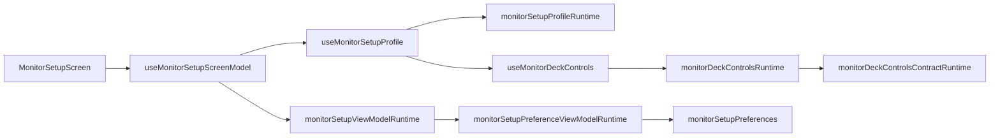

### Connections

- `desktop/src/features/simple/ConnectionsScreen.tsx`
- `desktop/src/features/simple/useConnectionsScreenState.ts`
- `desktop/src/features/simple/useConnectionTailController.ts`
- `desktop/src/features/simple/useConnectionTestController.ts`
- `desktop/src/features/simple/ConnectionsFormPanel.tsx`
- `desktop/src/features/simple/ConnectionsSavedListPanel.tsx`
- `desktop/src/features/simple/ConnectionsSavedRow.tsx`
- `desktop/src/features/simple/ConnectionsTailConsole.tsx`
- `desktop/src/features/simple/connectionsViewModel.ts`
- `desktop/src/features/simple/connectionsRuntime.ts`
- `desktop/src/features/simple/connectionsProbeRuntime.ts`
- `desktop/src/features/simple/connectionsScreenHookRuntime.ts`
- `desktop/src/features/simple/connectionsScreenStateRuntime.ts`
- `desktop/src/features/simple/connectionsSavedListViewModel.ts`
- `desktop/src/features/simple/connectionProbeMarkers.ts`

### Library

- `desktop/src/features/library/LibraryScreen.tsx`
- `desktop/src/features/library/useLibraryScreenController.tsx`
- `desktop/src/features/library/useLibraryScreenImportActions.ts`
- `desktop/src/features/library/useLibraryScreenToolbarActions.tsx`
- `desktop/src/features/library/LibraryTabStrip.tsx`
- `desktop/src/features/library/libraryScreenStateRuntime.ts`
- `desktop/src/features/library/libraryScreenControllerTypes.ts`
- `desktop/src/features/library/libraryScreenTypes.ts`
- `desktop/src/features/library/libraryScreenViewModel.ts`
- `desktop/src/features/library/libraryScreenToolbarRuntime.ts`
- `desktop/src/features/library/libraryPlaylistsViewModel.ts`
- `desktop/src/features/library/libraryConnectionsViewModel.ts`
- `desktop/src/features/library/libraryBaseAssetsViewModel.ts`
- `desktop/src/features/library/librarySourcesViewModel.ts`
- `desktop/src/features/library/libraryTracksViewModel.ts`
- `desktop/src/features/library/useLibraryScreenState.ts`
- `desktop/src/features/library/components/LibraryBaseAssetsListPanel.tsx`
- `desktop/src/features/library/components/LibraryConnectionsListPanel.tsx`
- `desktop/src/features/library/components/LibraryPlaylistsPanel.tsx`
- `desktop/src/features/library/components/LibrarySourcesListPanel.tsx`
- `desktop/src/features/library/components/LibraryTracksListPanel.tsx`
- `desktop/src/hooks/libraryRuntime.ts`
- `desktop/src/hooks/useLibraryBootstrap.ts`
- `desktop/src/hooks/useLibraryMutationActions.ts`
- `desktop/src/hooks/useLibraryTrackMutationActions.ts`
- `desktop/src/hooks/useLibraryPlaylistMutationActions.ts`
- `desktop/src/hooks/libraryMutationActionsTypes.ts`
- `desktop/src/hooks/useRepositories.ts`
- `desktop/src/hooks/useRepositoriesBootstrap.ts`
- `desktop/src/hooks/useRepositoryMutationActions.ts`
- `desktop/src/hooks/repositoriesRuntime.ts`
- `desktop/src/hooks/repositoryMutationActionsTypes.ts`
- `desktop/src/features/library/components/ImportTrackForm.tsx`
- `desktop/src/features/library/components/ImportRepositoryForm.tsx`
- `desktop/src/features/library/components/ImportBaseAssetForm.tsx`
- `desktop/src/features/library/components/ImportCompositionForm.tsx`

### Sessions

- `desktop/src/features/session/SessionScreen.tsx`
- `desktop/src/features/session/useSessionScreenController.ts`
- `desktop/src/features/session/useSessionScreenActions.ts`
- `desktop/src/features/session/useSessionScreenEffects.ts`
- `desktop/src/features/session/sessionScreenEffectsRuntime.ts`
- `desktop/src/features/session/sessionScreenViewModel.ts`
- `desktop/src/features/session/sessionDisplayFormatting.ts`
- `desktop/src/features/session/sessionDisplayBaseRuntime.ts`
- `desktop/src/features/session/sessionDisplaySourceRuntime.ts`
- `desktop/src/features/session/SessionScreenHeader.tsx`
- `desktop/src/features/session/SessionScreenNoticeStack.tsx`
- `desktop/src/features/session/SessionScreenPanels.tsx`
- `desktop/src/features/session/SessionBoothPanel.tsx`
- `desktop/src/features/session/SessionSetupPanel.tsx`
- `desktop/src/features/session/SessionSavedSessionsPanel.tsx`
- `desktop/src/features/session/SessionTemplatePresetStrip.tsx`
- `desktop/src/features/session/SessionWorkflowStrip.tsx`
- `desktop/src/features/session/SessionSetupSelectionGrid.tsx`
- `desktop/src/features/session/SessionCreateFooter.tsx`
- `desktop/src/features/session/SessionSavedSessionCard.tsx`
- `desktop/src/features/session/SessionReplayBookmarkPanel.tsx`
- `desktop/src/features/session/sessionScreenRuntime.ts`
- `desktop/src/features/session/sessionBoothViewModel.ts`
- `desktop/src/features/session/sessionDisplay.ts`

### Inspect surface

- `desktop/src/features/inspect/InspectScreen.tsx`
- `desktop/src/features/inspect/InspectTrackView.tsx`
- `desktop/src/features/inspect/InspectRepositoryView.tsx`
- `desktop/src/features/inspect/InspectBaseAssetView.tsx`
- `desktop/src/features/inspect/InspectContextBar.tsx`

## Recent refactor notes

- `desktop/src/features/analyzer/components/LiveWaveformCanvas.tsx` is now a thinner React shell. Canvas resize, analyser sampling, and frame drawing moved to `liveWaveformCanvasRuntime.ts`.
- `desktop/src/features/simple/monitorDeckCanvas.ts` is now only a public facade. The overview strip and the main deck renderer live in `monitorDeckOverviewCanvas.ts` and `monitorDeckMainCanvas.ts`.
- `desktop/src/features/session/sessionDisplay.ts` is now also a facade. Formatting, base-track lookup, and source/bed-url resolution live in dedicated runtimes.
- `desktop/src/features/simple/useConnectionsScreenState.ts` now focuses on form/list orchestration. Live tail polling moved to `useConnectionTailController.ts`, and adapter probe feedback moved to `useConnectionTestController.ts`.
- `desktop/src/features/monitor/MonitorContext.tsx` now uses `useMonitorProviderState.ts` as the shared state/ref scaffold, leaving provider composition closer to orchestration-only code.
- `desktop/src/features/analyzer/components/useLiveLogMonitorPanelRuntime.tsx` is now mostly a composition shell. Orchestrator, lifecycle, and deck-runtime input assembly moved to `liveLogMonitorPanelRuntimeBridge.ts`.
- `desktop/src/features/analyzer/components/useLiveLogMonitorPanelRuntimeState.tsx` is now a thin assembler over `buildLiveLogMonitorViewModel`, `useLiveLogMonitorPanelAudioRuntime`, and `useLiveLogMonitorReplayState`, with pure input/output shaping in `liveLogMonitorPanelRuntimeStateBridge.ts`.
- `desktop/src/features/analyzer/components/useLiveLogMonitorPanelDeckRuntime.tsx` is now a lighter shell over session actions, operator actions, deck model, and final render-state assembly, with callback shaping split into `liveLogMonitorPanelDeckCallbacksRuntime.ts` and the remaining prop wiring in `liveLogMonitorPanelDeckRuntimeBridge.ts`.
- `desktop/src/features/analyzer/components/useLiveLogMonitorDeckModel.tsx` now delegates panel/deck/scene/routing/live-props input shaping to `liveLogMonitorDeckModelBridge.ts`, leaving the hook focused on memoized composition.
- `desktop/src/features/analyzer/components/useLiveLogMonitorPanelAudioRuntime.ts` is now a thin composition layer over `useLiveLogMonitorPanelAudioCore.ts` and `useLiveLogMonitorPanelAudioEffects.ts`, while `liveLogMonitorPanelAudioInputRuntime.ts` and `liveLogMonitorPanelAudioFeedbackRuntime.ts` keep the pure shaping/warning behavior testable outside React.
- `desktop/src/features/session/SessionScreen.tsx` now delegates prop assembly for its header, notice stack, booth, and panel surfaces to `sessionScreenViewModel.ts`.
- `desktop/src/features/session/SessionSetupPanel.tsx` and `SessionSavedSessionsPanel.tsx` now delegate their large visual sections to dedicated subcomponents, making session setup and replay surfaces easier to maintain and test in isolation.
- This keeps the visual monitor path closer to the same architecture already used in library, session, and live-monitor audio: shell + controller/runtime + focused tests.
- `desktop/src/features/inspect/InspectEmptyState.tsx`

## Section ownership

The current frontend is intentionally split into three layers:

1. **Shell composition**
   - section selection
   - language / skin preferences
   - sidebar status
   - high-level monitor launch wiring
2. **Feature surfaces**
   - monitor
   - setup
   - connections
   - library
3. **Pure runtimes / view-models**
   - monitor playback and polling
   - anomaly focus and tail sync
   - connection draft serialization
   - library tabs / toolbar / empty-state derivation
   - visual deck derivations

This is the core rule contributors should preserve: avoid re-growing screen files by pushing logic downward into pure, testable modules.

Recent examples of that direction:

- `useAppV0ContentModel.ts` now owns the section/model assembly used by `App-v0.tsx`, leaving the mounted shell as provider composition plus final render
- `useAppV0ScreenModel.ts` now owns the final App-v0 shell/content model assembly, leaving `useAppV0ContentModel.ts` closer to dependency orchestration than view-model construction
- `appSectionContentRuntime.ts` now owns the pure visibility rules for the legacy `App.tsx` section selector, while `AppSectionContent.tsx` keeps the actual lazy surface composition
- `useAppCatalogActions.ts` now owns the legacy shell catalog/import/update/delete handlers so `App.tsx` no longer mixes section composition with track/repository mutation flows
- `useAppContentController.ts` now keeps its public shell contract while delegating analyzer/bootstrap state to `useAppContentBootstrap.ts`, UI shell preferences/state to `useAppContentShellState.ts`, navigation/background actions to `useAppContentNavigationActions.ts`, and session-bookmark refresh side effects to `useAppContentSessionEffects.ts`
- `useAppMonitorActions.ts` is now a thin composition hook over `useAppMonitorGuideActions.ts` and `useAppMonitorSessionActions.ts`, while `appMonitorActionsRuntime.ts` keeps pure replay/session persistence derivations testable outside React
- `SimpleMonitorScreen.tsx` is now a thin surface selector. The orchestration, launch-state, and deck-state responsibilities live in `useSimpleMonitorScreenState.ts` plus dedicated simple-monitor runtimes
- `useSimpleMonitorScreenState.ts` now delegates anomaly-filter state to `useSimpleMonitorAnomalyFilterState.ts` and explicit launch/deck slice shaping to `simpleMonitorScreenSlicesRuntime.ts`, keeping the monitor shell hook closer to orchestration than object assembly
- `useSimpleMonitorScreenController.ts` now owns the launch/deck/anomaly composition beneath `useSimpleMonitorScreenState.ts`, so the public simple-monitor hook mostly assembles the final active/idle view state
- `useSimpleMonitorDeckController.ts` now owns the sub-hook composition beneath `useSimpleMonitorDeckRuntime.ts`, leaving the deck runtime as a stable facade over the assembled deck state
- `useMonitorSetupProfile.ts`, `monitorSetupProfileRuntime.ts`, `monitorDeckControlsRuntime.ts`, and `monitorDeckControlsContractRuntime.ts` now isolate setup-profile composition, deck-control storage, and pure deck-control contract rules from the setup screen shell
- `monitorSetupPreferences.ts` now stays focused on persisted setup defaults and sanitization, while `monitorSetupPreferenceViewModelRuntime.ts` owns the UI-facing setup field/group metadata used by the deck-style preferences rack
- `useMonitorDeckControls.ts` now persists operator deck controls by skin, so Setup and live Monitoring recover the same profile for the currently selected booth theme
- `LibraryScreen.tsx` now delegates state orchestration, toolbar actions, import/delete side effects, and connection refresh behavior to `useLibraryScreenController.tsx`, while `LibraryTabStrip.tsx` owns tab rendering
- `useLibraryScreenController.tsx` is now a lighter composition hook over `useLibraryScreenState.ts`, `useLibraryScreenImportActions.ts`, `useLibraryScreenToolbarActions.tsx`, and `libraryScreenToolbarRuntime.ts`
- `useLibraryScreenController.tsx` now also delegates state-hook, import-hook, view-model, toolbar-input, and final controller-contract assembly to `libraryScreenControllerHookRuntime.ts`, keeping the controller closer to a pure composition seam
- `useLibraryScreenState.ts` now delegates tab-change, connection-refresh, playlist-sync, and playlist-save payload assembly to `libraryScreenStateHookRuntime.ts`, so playlist-editor lifecycle and log-connection refresh rules stay explicit without re-growing the hook body
- `InspectScreen.tsx` now delegates render-state/context-bar input shaping plus placeholder/view prop assembly to `inspectScreenHookRuntime.ts`, keeping the inspect screen closer to a route shell instead of a mixed branch-and-props file
- `ComposeScreen.tsx` now delegates compose view-model input shaping plus summary/picker/preview/render prop assembly to `composeScreenHookRuntime.ts`, so composition preview routing stays explicit while the JSX shell keeps only the actual screen layout
- `LiveLogMonitorPanel.tsx` is now a thin composition shell over `useLiveLogMonitorPanelController.tsx` and `useLiveLogMonitorPanelRuntime.tsx`, making monitor runtime wiring directly unit-testable
- `useLibrary.ts` now acts as a thin composition hook over `useLibraryBootstrap.ts` and `useLibraryMutationActions.ts`, while the mutation facade delegates track flows to `useLibraryTrackMutationActions.ts` and playlist flows to `useLibraryPlaylistMutationActions.ts`
- `useRepositories.ts` now mirrors that same shape, delegating hydration to `useRepositoriesBootstrap.ts` and user-side import/reanalyze/delete flows to `useRepositoryMutationActions.ts`
- `useSessionScreenController.ts` now delegates command handlers to `useSessionScreenActions.ts` and monitor/audio/event side effects to `useSessionScreenEffects.ts`
- `useSessionScreenEffects.ts` now delegates booth-bed audio lifecycle and session-event loading policy to `sessionScreenEffectsRuntime.ts`, leaving the hook focused on React effect orchestration
- `MonitorDeckHeader.tsx` now delegates focus-bar visibility, tone classes, and cue-label shaping to `monitorDeckHeaderRuntime.ts`, keeping the deck header closer to pure presentation
- `useAppV0PreferencesState.ts` now delegates storage hydration to `useAppV0PreferencesHydration.ts`, persistence/skin syncing to `useAppV0PreferencesPersistence.ts`, and setup-field sanitization to `appV0PreferencesStateRuntime.ts`
- `useAppContentController.ts` now delegates domain-hook bootstrap to `useAppContentDomainState.ts` and action wiring to `useAppContentActionBundles.ts`, leaving the legacy shell controller closer to route/status composition
- `useAppContentController.ts` now also delegates route/status/mutation derivation and session-bookmark refresh side effects to `useAppContentDerivedState.ts`, keeping the legacy shell controller closer to pure composition over domain state and action bundles
- `monitorDeckMainCanvas.ts` now acts as a thin render orchestrator over `monitorDeckMainCanvasLayers.ts`, so track lane, log lane, and overlay/playhead drawing are separated into explicit deck-render stages
- `monitorDeckMainCanvasSceneRuntime.ts` now owns the pure scene-planning data for the main deck canvas, while `monitorDeckMainCanvasLayers.ts` stays focused on immediate canvas painting
- `monitorDeckMainCanvasPaintRuntime.ts` is now a stable facade over `monitorDeckBackgroundLaneRuntime.ts`, `monitorDeckTrackLaneRuntime.ts`, `monitorDeckLogLaneRuntime.ts`, and `monitorDeckOverlayLaneRuntime.ts`, while `monitorDeckCanvasGradientRuntime.ts` owns the shared rect/gradient primitives that keep each lane painter focused on deck surfaces instead of canvas plumbing
- `monitorDeckCanvasOverlayRuntime.ts` now owns visible anomaly/beam/burst geometry planning so `monitorDeckCanvasDrawRuntime.ts` keeps less positioning policy inline
- `monitorDeckCanvasWaveRuntime.ts` now owns waveform, phrase-ribbon, energy-band, and quantized log-block primitives, while `monitorDeckCanvasReactiveOverlayRuntime.ts` owns anomaly wash, burst-region, and selected-marker beam painting
- `monitorDeckCanvasDrawRuntime.ts` is now a stable facade over those two drawing runtimes, keeping existing deck/overview canvas imports intact while the implementation stays split by responsibility
- `useSimpleMonitorDeckVisualState.ts` now delegates canvas-render side effects to `useSimpleMonitorDeckCanvasEffects.ts`, keeping the visual-state hook centered on derived state and scrub wiring
- `useMonitorLiveStream.ts` now delegates mirrored imperative stream refs to `useMonitorLiveStreamStateRefs.ts`, reducing the live-stream hook to bootstrap, subscription, cue, and idle orchestration
- `useMonitorTrackAudio.ts` now acts as a composition shell over `useMonitorTrackPreviewAudio.ts` and `useMonitorTrackBackgroundAudio.ts`, separating preview playback from background deck playback/progress effects
- `useMonitorLiveStream.ts` now composes `useMonitorLiveStreamLifecycle.ts`, `useMonitorLiveStreamSubscription.ts`, and `useMonitorLiveStreamIdleMotion.ts`, so the public stream hook mostly owns state exposure plus simulation
- `MonitorDeckControlPanel.tsx` now renders from `monitorDeckControlPanelRuntime.ts`, making the setup rack declarative instead of hand-coded field-by-field JSX
- `useSimpleMonitorDeckLiveController.ts` now delegates active-track/duration ref mirroring to `useSimpleMonitorDeckLiveRefs.ts`, leaving the controller focused on composing reactive-audio, track-audio, and live-stream hooks
- `useSimpleMonitorDeckLiveController.ts` now also delegates live deck orchestration decisions to `simpleMonitorDeckLiveControllerRuntime.ts`, so the hook keeps less mutation/stream input shaping inline
- `useSimpleMonitorReactiveAudio.ts` now delegates ref/lifecycle synchronization to `useSimpleMonitorReactiveAudioRefs.ts` and raw oscillator playback to `simpleMonitorReactiveAudioPlaybackRuntime.ts`
- `useSimpleMonitorReactiveAudio.ts` now also routes background-graph bootstrap and mutation application through `simpleMonitorReactiveAudioControllerRuntime.ts`, leaving the hook closer to React lifecycle orchestration
- `useMonitorLiveStream.ts` now routes lifecycle/subscription/idle-motion state assembly through `monitorLiveStreamControllerRuntime.ts`, keeping the public hook closer to effect wiring plus exposed state
- `useMonitorDeckScrub.ts` now delegates pointer/click interaction planning to `monitorDeckScrubControllerRuntime.ts`, reducing inline event-policy logic in the hook
- `simpleMonitorScreenSectionsRuntime.ts` now resolves active/idle section args through focused helpers instead of keeping all section wiring inline in one builder
- `simpleMonitorDeckRuntime.ts` is now a facade over `simpleMonitorDeckStateRuntime.ts`, `simpleMonitorDeckHookInputsRuntime.ts`, and `simpleMonitorDeckHookStateRuntime.ts`, reducing the runtime barrel that used to mix three different concerns
- `monitorDeckCanvasWaveRuntime.ts` now delegates sample-window aggregation and color/block decisions to `monitorDeckCanvasDrawMetricsRuntime.ts`, leaving the waveform drawing runtime closer to painting than analytics
- `connectionsViewModel.ts` is now a small facade over `connectionsDraftRuntime.ts`, `connectionsFormViewModelRuntime.ts`, and `connectionsUpsertRuntime.ts`, instead of mixing draft hydration, form copy, and payload validation in one file
- `connectionsSavedListViewModel.ts` now delegates sorting, meta-chip derivation, and row assembly to `connectionsSavedListViewModelRuntime.ts`, leaving the public builder focused on screen-level copy
- `useAppContentController.ts` now delegates status input shaping, mutation/session-effect input shaping, and final controller assembly to `appContentControllerRuntime.ts`
- `useAppV0ContentModel.ts` now delegates monitor-state/screen-model input assembly to `appV0ContentModelRuntime.ts`, keeping the mounted App-v0 hook focused on composing domain hooks
- `useAppV0SectionContentModel.ts` now delegates content-action and section-input assembly to `appV0SectionContentModelHookRuntime.ts`, so App-v0 section wiring stays readable without mixing callback plumbing and section-state mapping inline
- `useAppV0ScreenModel.ts` now delegates final shell/content composition args to `appV0ScreenModelHookRuntime.ts`, keeping the App-v0 screen-model seam closer to a pure wiring layer
- `useConnectionsFormController.ts` now routes repository-API, browse/save/delete, and refresh payload assembly through `connectionsFormControllerHookRuntime.ts`, so saved-connection CRUD behavior remains directly testable outside React
- `useConnectionsScreenState.ts` now routes form/tail/test dependency shaping through `connectionsScreenStateHookRuntime.ts`, making the Connections screen shell read more like orchestration than inline API wiring
- `useMonitorSetupProfile.ts` now delegates deck-control input shaping and setup profile/view-model output contracts to `monitorSetupProfileHookRuntime.ts`, so Setup keeps the same behavior while exposing a clearer seam for future skin/defaults work
- `useMonitorSetupScreenModel.ts` now delegates profile-input and screen-model result assembly to `monitorSetupScreenModelHookRuntime.ts`, keeping the Setup screen shell aligned with the same thin-hook pattern used elsewhere
- `useSessionScreenController.ts` now delegates monitor snapshot, action-input, derived-input, memo-dependency, and booth-input shaping to `sessionScreenControllerHookRuntime.ts`, reducing controller churn and making Session orchestration easier to trace for contributors
- `useReplayBookmarks.ts` is now a facade over `useReplayBookmarkDraftState.ts`, `useReplayBookmarkPersistence.ts`, and payload helpers in `replayBookmarksRuntime.ts`, separating replay-draft sync from persistence
- `useSessions.ts` is now a facade over `useSessionsPersistence.ts`, `useSessionBookmarksLoader.ts`, and `sessionsStateRuntime.ts`, separating session bootstrap, bookmark hydration, and state commits
- `useAppCatalogLibraryActions.ts` now delegates the repeated result/boolean/update notification flows to `appCatalogLibraryActionsRuntime.ts`, leaving the hook focused on wiring domain methods to copy
- `useAppCatalogImportActions.ts` now delegates import success notices, post-import navigation, and repository log-rescue flow to `appCatalogImportActionsRuntime.ts`
- `useAppMonitorGuideActions.ts` now delegates the imperative application of arm-state and guide-state to `appMonitorGuideActionsRuntime.ts`, leaving the hook focused on resolving selection state from runtime helpers
- `useAppMonitorSessionActions.ts` now delegates replay/live payload assembly and monitored-repo navigation defaults to `appMonitorSessionActionsRuntime.ts`, leaving the hook focused on async control flow
- `useLiveLogMonitorPanelRuntimeState.tsx` now delegates the audio/background/reset/sample/sync stack to `useLiveLogMonitorPanelAudioRuntime.ts`, whose core/effects split keeps the panel state hook free from deeper audio wiring details

## Current refactor status

Areas that are now structurally healthy:

- mounted shell routing and section selection
- monitor provider runtime/orchestration
- simple monitor launch/deck/view-model layer
- live monitor panel controller/runtime shell
- session screen composition
- library screen controller and tab shell
- repository hydration and mutation flow composition

Areas that still carry the most debt:

- `desktop/src/features/analyzer/components/liveLogMonitorPanelAudioInputRuntime.ts`
- `desktop/src/features/analyzer/components/liveLogMonitorPanelViewModel.ts`
- `desktop/src/features/analyzer/components/liveLogMonitorAudioRuntime.ts`
- `desktop/src/features/analyzer/components/useLiveLogMonitorBackgroundAudioEngine.ts`
- `desktop/src/features/analyzer/components/useManagedAudioPlayerController.ts`

Those modules should be the next extraction targets before broad visual redesign work or public contributor onboarding expands.
- `useAppSelectionActions.ts` now owns legacy shell selection, inspection, and simple-monitor navigation callbacks so `App.tsx` passes stable feature actions instead of large inline closures
- `WaveformPlaceholder.tsx` now delegates composed interaction/runtime assembly to `useWaveformPlaceholderViewModel.ts`, reducing one more large inline derivation block in the waveform editor shell
- `LiveWaveformCanvas.tsx` now delegates the analyser-driven animation loop and canvas lifecycle to `useLiveWaveformCanvasController.ts`, keeping the component closer to a presentational shell
- `useLiveLogMonitorPanelRuntimeState.tsx` now delegates memoized live-monitor view-state assembly to `useLiveLogMonitorPanelViewState.ts`, leaving the runtime seam clearer between pure deck derivation and audio/replay wiring
- `useAppV0ContentModel.ts` now delegates mounted-shell domain-hook assembly to `useAppV0DomainState.ts`, leaving the App-v0 content model closer to monitor/screen composition than raw dependency collection
- `AppTopbar.tsx`, `AppMonitorOverview.tsx`, and `appShellRuntime.ts` now isolate legacy shell branding/control rendering plus now-playing visibility from `App.tsx`
- `AppCurateSection.tsx` and `AppSessionSection.tsx` now isolate library/session screen wiring from `AppSectionContent.tsx`, leaving the compatibility router closer to pure section selection
- `monitorLiveStreamRuntime.ts` now owns reset-state and hook-state snapshot builders for live tail state
- `liveLogMonitorSessionRuntime.ts` now also owns live-monitor start reset defaults and beat-clock / beat-looper boot planning so `handleStart` keeps less session-start policy inline
- `connectionsRuntime.ts` now owns the final hook-state snapshot returned by `useConnectionsScreenState`
- `connectionsScreenStateRuntime.ts` now owns the async connection CRUD/test orchestration used by `useConnectionsScreenState`
- `simpleMonitorReactiveAudioRuntime.ts` now owns imperative graph automation steps and the hook-state snapshot for reactive deck audio
- `monitorContextValue.ts` now owns the final provider snapshot returned by `MonitorContext`
- `monitorGuideTrackDecodeRuntime.ts` now owns guide-track decode caching, fetch/IPC fallback, and mono PCM normalization
- `monitorProviderGuideTrackRuntime.ts` now owns provider-level active-template changes plus guide-track queue and seek controls
- `monitorProviderLiveRuntime.ts` now owns provider-level stream update emission, persisted poll-index advancement, and poll-loop wiring
- `monitorProviderSessionRuntime.ts` now owns provider-level start/attach orchestration for live sessions before control returns to `MonitorContext`
- `monitorProviderPlaybackSessionRuntime.ts` now owns provider-level replay-session orchestration, including activation, audio bootstrap, and optional hydration wiring
- `SessionScreenHeader.tsx`, `SessionScreenNoticeStack.tsx`, and `SessionScreenPanels.tsx` now keep session-shell rendering separate from the `SessionScreen.tsx` orchestration flow
- `monitorProviderStartRuntime.ts` now owns the shared live-session start wiring reused by `startSession` and `attachSession`
- `monitorProviderStartRuntime.ts` now also owns the reusable base live-start input snapshot shared by `startSession` and `attachSession`, so `MonitorContext.tsx` keeps less provider wiring inline
- `monitorProviderPlaybackControlsRuntime.ts` now owns provider-level playback guards and guide-track-sync wiring for seek, pause, resume, and stepping
- `liveLogMonitorAudioRuntime.ts` now owns pure background-mutation derivation and managed WAV-blob playback helpers for the analyzer live monitor
- `liveLogMonitorPanelRuntime.ts` now owns pure tail/anomaly derivations and synchronized tail-row shaping for the analyzer live monitor panel
- `liveLogMonitorViewModel.ts` now owns pure deck/playlist/replay/adapter derivations for the analyzer live monitor so the panel keeps less orchestration-only display logic
- `liveLogMonitorLiveDeckPropsRuntime.ts` now owns the pure playlist/session/replay/operations prop builders for the live deck shell, leaving `liveLogMonitorDeckPropsViewModel.tsx` closer to node composition than repeated prop assembly
- `liveLogMonitorDeckSectionRuntime.ts` now owns the pure activity/trace/performance/sequencer prop builders for the active analyzer deck, leaving `liveLogMonitorDeckPropsViewModel.tsx` closer to React node composition
- `liveSonificationSampleSourceRuntime.ts` now owns playable-audio detection, managed sample-source fallback, and per-route sample assignment so `liveSonificationSceneRuntime.ts` keeps less file/path policy inline
- `liveSonificationRouteRuntime.ts` now owns route-lane construction from sections, cue points, render-preview stems, and sample-source assignment so `liveSonificationSceneRuntime.ts` keeps less arrangement-structure policy inline
- `liveSonificationCueRoutingRuntime.ts` now owns cue-level note/gain/pan transformation and mute override handling so `liveSonificationSceneRuntime.ts` keeps less cue-routing math inline
- `liveSonificationSceneRuntime.ts` is now a stable facade over `liveSonificationSceneResolutionRuntime.ts` and `liveSonificationSceneSummaryRuntime.ts`, so scene input resolution and summary formatting stay split from the public scene/cue entrypoints
- `liveSonificationSceneProfileCatalog.ts` now acts as the stable helper layer over `liveSonificationSceneProfileData.ts`, and that data file is further split into dedicated category, strategy, genre, and sequencer preset datasets so the catalog no longer concentrates the entire sonification taxonomy in one place
- `compositionPreview.ts` is now a stable facade over `compositionPreviewFieldsRuntime.ts`, `compositionPreviewArrangementRuntime.ts`, and `compositionPreviewRenderRuntime.ts`, while the render seam now routes into dedicated derived-preview, derived-stem, derived-automation, and persisted-preview runtimes so analyzer consumers keep the same imports while render derivation stays split by source and concern
- `trackPerformancePanelViewRuntime.ts` and `trackPerformancePanelActionsRuntime.ts` now split metric/label derivation from mutable performance actions, leaving `trackPerformancePanelRuntime.ts` as a stable public facade
- `liveLogMonitorPlaylistEditorRuntime.ts` now owns pure base-playlist editing operations so deck setup changes are reusable and directly testable
- `liveLogMonitorPlaylistViewState.ts` now owns playlist summary/editor/option derivation for the live monitor deck
- `liveLogMonitorInteractionRuntime.ts` now owns replay bookmark jump and anomaly-trace selection state so scrubbing logic is no longer embedded directly in the panel body
- `liveLogMonitorControlRuntime.ts` now owns live-monitor start warnings, session id creation, failure formatting, and beat-looper defaults
- `liveLogMonitorAudioCleanupRuntime.ts` now owns stop-time graph teardown for the live monitor audio chain
- `liveLogMonitorPreferencesRuntime.ts` now owns repo-switch reset defaults, guide-track playlist seeding, and persisted monitor-preferences payload shaping for the live monitor panel
- `liveLogMonitorBackgroundRuntime.ts` now owns pure background-deck lifecycle, transition scheduling, and start-plan derivation so `LiveLogMonitorPanel.tsx` keeps only the imperative audio-node wiring
- `liveLogMonitorMutationRuntime.ts` now owns reactive mutation resolution and background-automation plan derivation so `LiveLogMonitorPanel.tsx` no longer mixes DSP formulas with `AudioParam` scheduling
- `liveLogMonitorCuePlaybackRuntime.ts` now owns cue-layer playback planning, audible-voice filtering, and sample/track-slice/oscillator routing decisions so `LiveLogMonitorPanel.tsx` keeps less arrangement-only logic inline
- `liveLogMonitorStreamUpdateRuntime.ts` now owns known-component merging, recent-history derivation, tail-window selection, and explanation-selection rules so `onStreamUpdate` keeps less UI-state derivation inline
- `liveLogMonitorActionRuntime.ts` now owns stop-reset defaults, bounce filename derivation, and bookmark/replay-feedback profile selection so `LiveLogMonitorPanel.tsx` keeps less action-policy logic inline
- `liveLogMonitorSequencerRuntime.ts` now owns sequencer preview batching and preview-volume derivation so `handleSequencerStepFire` keeps less timing-policy logic inline
- `liveLogMonitorCueExecutionRuntime.ts` now owns external cue-layer gating, bounce-window accumulation, and beat-locked cue event timing so `playWithCurrentEngine` keeps less transport orchestration inline
- `liveLogMonitorCueScheduleRuntime.ts` now owns cue offset/duration/playback-rate heuristics and Web Audio cue scheduling wrappers so the panel keeps less per-voice transport math inline
- `liveLogMonitorBeatRuntime.ts` now owns beat-clock subdivision timing and beat-looper pulse scheduling so the panel keeps less tempo-runtime wiring inline
- `liveLogMonitorUpdateDerivationRuntime.ts` now owns known-component expansion, routed cue derivation, current-track lookup, and mutation explanation derivation so `onStreamUpdate` keeps less domain logic inline
- `liveLogMonitorSampleRuntime.ts` now owns managed sample-source resolution plus fetch/decode helpers so sample-bank loading logic is no longer embedded in the panel effect body
- `liveLogMonitorBackgroundDeckRuntime.ts` is now a stable facade over `liveLogMonitorBackgroundDeckTypes.ts`, `liveLogMonitorBackgroundDeckSnapshotRuntime.ts`, and `liveLogMonitorBackgroundDeckBufferRuntime.ts`, so background-deck shape, snapshot derivation, and guide-track buffer loading stay separated
- `liveLogMonitorViewModelRuntime.ts` is now a stable facade over `liveLogMonitorTrackSelectionRuntime.ts`, `liveLogMonitorExplanationRuntime.ts`, and `liveLogMonitorAdapterRuntime.ts`, so the analyzer deck keeps one import seam while track selection, explanation replay mapping, and adapter/cue-preview derivation stay split by concern
- `liveLogMonitorDisplayRuntime.ts` is now a stable facade over `liveLogMonitorDisplayStateRuntime.ts` and `liveLogMonitorDisplayMetricsRuntime.ts`, so deck-state labels/anomaly slices and session/metric/cue-engine summaries evolve independently behind one analyzer display seam
- `liveLogMonitorDisplayMetricsRuntime.ts` is now a stable facade over `liveLogMonitorCueEngineDisplayRuntime.ts`, `liveLogMonitorSessionCardRuntime.ts`, and `liveLogMonitorMetricGridRuntime.ts`, so cue-engine labels, replay/session summaries, and metric-grid assembly evolve independently behind the same monitor display seam
- `liveLogMonitorMetricGridRuntime.ts` is now a stable facade over `liveLogMonitorMetricGridRowsRuntime.ts` and `liveLogMonitorMetricGridFormatRuntime.ts`, so the metric ordering/table shape and the per-metric value formatting evolve independently behind the same monitor HUD seam
- `liveLogMonitorPanelViewModelRuntime.ts` now delegates status-display and playlist collection/summary assembly to focused runtimes, so bounce/session/cue labels and playlist derivation evolve independently behind the same monitor panel seam
- `liveLogMonitorPanelDeckRuntimeBridge.ts` is now a stable facade over dedicated session-actions, operator-actions, deck-model, and render-state bridge runtimes, so the deck shell wiring evolves independently by concern behind the same monitor deck seam
- `liveLogMonitorDeckPropsViewModel.tsx` is now a stable facade over `liveLogMonitorDeckSectionContentRuntime.tsx`, `liveLogMonitorDeckPanelsRuntime.tsx`, and `liveLogMonitorLiveDeckPropsBuilderRuntime.tsx`, so active deck content, scene/routing panels, and live-deck prop assembly stay split by concern without changing the deck-model import surface
- `liveSonificationGenreProfileData.ts` is now a small merge point over `liveSonificationDanceGenreProfileData.ts` and `liveSonificationAcousticGenreProfileData.ts`, so the sonification taxonomy no longer concentrates every genre preset in a single dataset file
- `liveSonificationDanceGenreProfileData.ts` is now a small merge point over `liveSonificationHouseGenreProfileData.ts` and `liveSonificationClubGenreProfileData.ts`, so the dance-oriented taxonomy no longer concentrates all club and house presets in a single dataset file
- `monitorDeckCanvasPaletteRuntime.ts` is now a stable facade over `monitorDeckBasePaletteRuntime.ts` and `monitorDeckSkinPaletteRuntime.ts`, so default deck palette data and skin-specific glow overrides evolve independently behind the same simple-monitor palette seam
- `monitorDeckBasePaletteRuntime.ts` is now a stable facade over `monitorDeckPassiveBasePaletteRuntime.ts`, `monitorDeckBalancedBasePaletteRuntime.ts`, and `monitorDeckAlertBasePaletteRuntime.ts`, so each deck energy preset owns its own dataset instead of concentrating the full base palette table in one runtime
- `monitorDeckSkinPaletteRuntime.ts` is now a stable facade over `monitorDeckGlowAlphaRuntime.ts`, `monitorDeckArcticSkinPaletteRuntime.ts`, and `monitorDeckCopperSkinPaletteRuntime.ts`, so glow-intensity helpers and per-skin overrides evolve independently behind the same deck skin seam
- `compositionPreviewDerivedStemRuntime.ts` is now a stable facade over `compositionPreviewDerivedStemBaseRuntime.ts` and `compositionPreviewDerivedSpotlightStemRuntime.ts`, so deterministic stem-preview defaults and spotlight-only embellishments evolve independently behind the same analyzer preview seam
- `compositionPreviewDerivedStemBaseRuntime.ts` is now a stable facade over `compositionPreviewFoundationStemRuntime.ts`, `compositionPreviewMotionStemRuntime.ts`, and `compositionPreviewGlueStemRuntime.ts`, so each deterministic preview stem role evolves independently behind the same analyzer base-stem seam
- `useLiveLogMonitorResetActions.ts` now owns repository/start/stop reset application so the panel keeps less repeated state-reset wiring inline
- `useLiveLogMonitorBackgroundLifecycle.ts` now owns the background-deck lifecycle effect so the panel keeps less live/suspend/start/restart orchestration inline
- `useLiveLogMonitorBackgroundDeckControl.ts` now owns guide-track start/stop/transition orchestration so the panel keeps less background-deck transport wiring inline
- `useLiveLogMonitorAudioBootstrap.ts` now owns shared/local audio-context boot plus master/analyser graph initialization so the panel keeps less audio-session startup wiring inline
- `useLiveLogMonitorBackgroundAudioEngine.ts` now owns background-bus initialization plus reactive mutation automation so the panel keeps less Web Audio graph control inline
- `useLiveLogMonitorAuxPlayback.ts` now owns rendered-blob playback fallback plus panel test-tone playback so the panel keeps less one-shot cue-output wiring inline
- `useLiveLogMonitorSampleBank.ts` now owns the sample-bank loading lifecycle so `LiveLogMonitorPanel.tsx` keeps less async resource-loading code inline
- `useLiveLogMonitorSurfaceSync.ts` now owns monitor preference persistence plus volume/scroll/style synchronization effects so the panel keeps less surface-only effect wiring inline
- `useLiveLogMonitorSurfaceState.ts` now owns the local refs/state scaffold for the live monitor so `LiveLogMonitorPanel.tsx` keeps less declaration noise inline
- `useLiveLogMonitorReplayState.ts` now owns replay bookmark + feedback wiring so `LiveLogMonitorPanel.tsx` keeps less replay interaction state inline
- `useLiveLogMonitorDeckModel.tsx` now owns the deck presentation assembly so `LiveLogMonitorPanel.tsx` keeps less `useMemo`-driven prop composition inline
- `useLiveLogMonitorLifecycle.ts` now owns repo-reset, guide-track seed, blob cleanup, and stream subscription effects so `LiveLogMonitorPanel.tsx` keeps less lifecycle/orchestration wiring inline
- `useLiveLogMonitorSessionActions.ts` now owns live start/stop/bounce operator actions so `LiveLogMonitorPanel.tsx` keeps less transport-startup and teardown policy inline
- `useLiveLogMonitorOperatorActions.ts` now owns volume mute/restore, replay feedback application, bookmark jumps, and trace explanation selection so the panel keeps less operator-interaction policy inline
- `useMonitorProviderGuideTrack.ts` now owns guide-track template, queue, seek, and deferred reload wiring so `MonitorContext.tsx` keeps less decode/playlist orchestration inline
- `useMonitorProviderPlaybackControls.ts` now owns replay pause/resume/seek/step wiring so `MonitorContext.tsx` keeps less playback-control plumbing inline
- `LiveLogMonitorDeckSection.tsx` now owns active-deck composition, mutation trace, and sequencer wiring for the analyzer live monitor
- `LiveLogMonitorLiveDeck.tsx` now owns the live deck composition block so `LiveLogMonitorPanel.tsx` no longer renders every live subsection inline
- `LiveWaveformCanvas.tsx` now isolates the analyser-driven waveform rendering loop from the broader live monitor orchestration
- `appV0MonitorScreenStateRuntime.ts` now owns pure App-v0 monitor-shell derivations and orchestrator assembly so the hook mostly wires dependencies
- `simpleMonitorScreenOrchestrationRuntime.ts` now owns the assembly of launch input, deck input, and final hook-state args for the simple monitor flow
- `InspectTrackView.tsx`, `InspectRepositoryView.tsx`, and `InspectBaseAssetView.tsx` now split the inspect surface by asset mode, leaving `InspectScreen.tsx` as a lightweight selector/composer
- `TrackCueList.tsx` and `TrackSavedLoopList.tsx` now isolate repeated performance-edit UI blocks from `TrackPerformancePanel.tsx`

## Shell composition flow

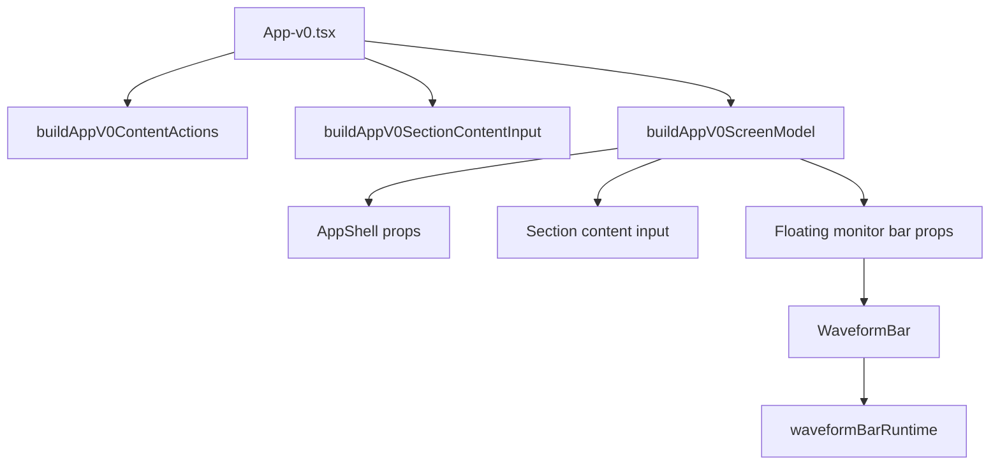

## Runtime flow

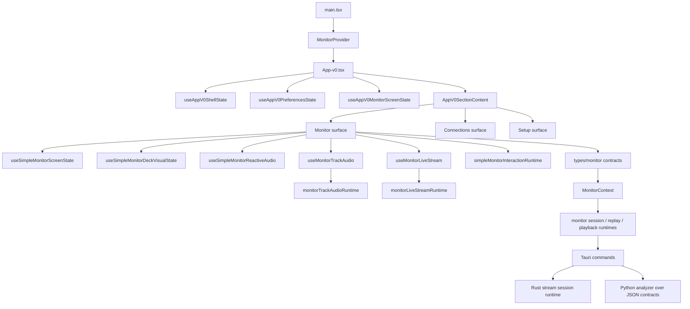

## Monitor startup flow

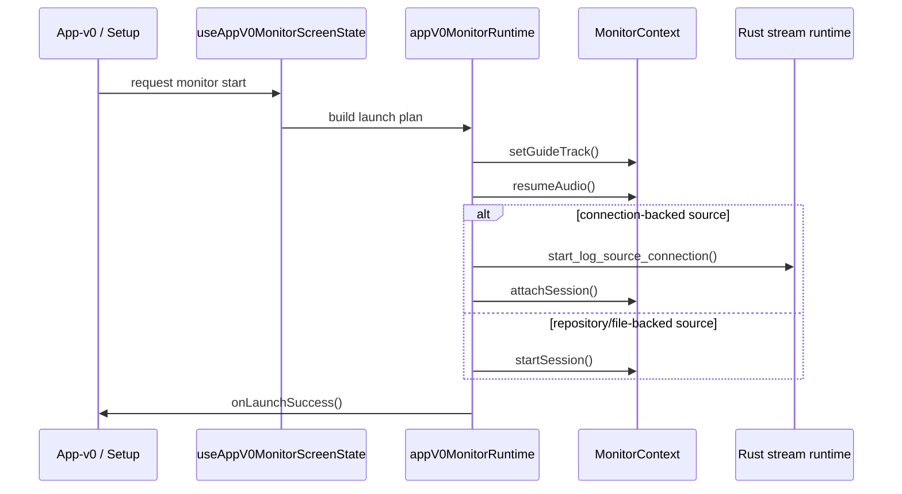

## Monitor interaction flow

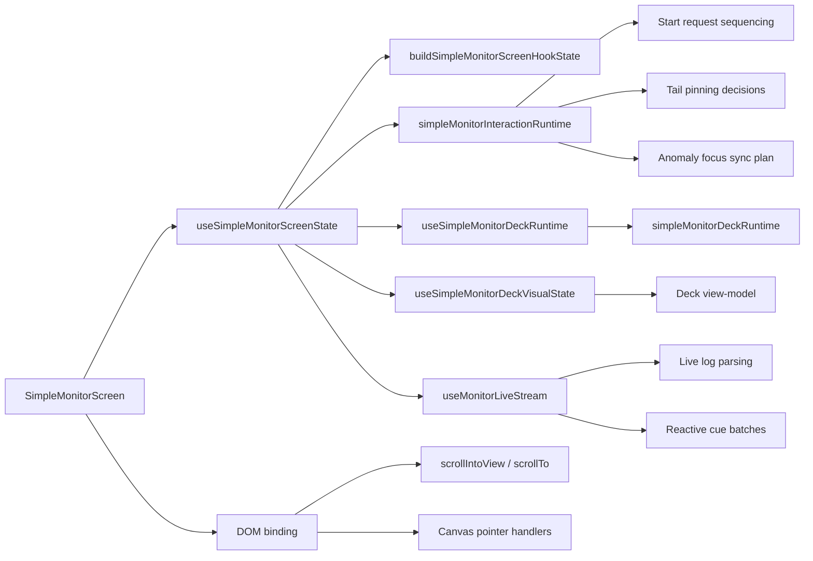

## Monitor runtime internals

```mermaid
flowchart TD
  A[MonitorContext] --> B[monitorStartupRuntime]
  A --> C[monitorSessionRuntime]
  A --> D[monitorReplayRuntime]
  A --> E[monitorPlaybackRuntime]
  A --> F[monitorOrchestrationRuntime]
  A --> G[monitorAudioRuntimeTypes]
  A --> H[monitorAudioSynthesisRuntime]
  A --> O[monitorContextRuntime]
  A --> Q[monitorProviderRuntimeOrchestrationTypes]
  A --> R[monitorProviderControllerRuntime]
  A --> Y[monitorProviderControllerViewRuntime]
  A --> U[monitorProviderSessionActionTypes]
  A --> V[monitorProviderSessionControllerRuntime]
  A --> Z[monitorProviderPlaybackSessionControllerRuntime]
  C --> N[Live poll cycle]
  D --> I[Replay rebuild + metrics]
  E --> J[Seek / pause / step / resume]
  F --> K[Session replacement + activation]
  G --> L[Guide-track PCM and crossfade contracts]
  H --> M[Guide-track slice and synth rendering]
  O --> P[Audio context lifecycle and probe playback]
  Q --> S[Grouped provider slices]
  R --> T[Controller-side orchestration input assembly]
  Y --> AA[Guide-track, playback-controls, and context-value wiring]
  U --> W[Grouped session-action slices]
  V --> X[Controller-side session input assembly]
  Z --> AB[Controller-side playback startup input assembly]
```

## Connections flow

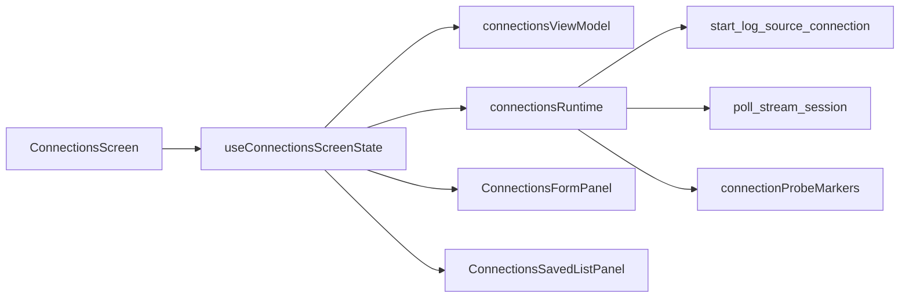

## Audio + deck flow

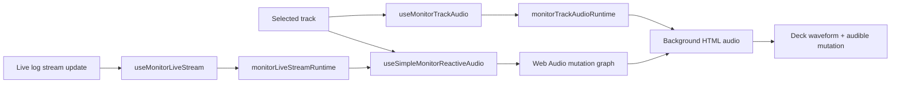

## Frontend quality goals

When touching the frontend, contributors should generally prefer:

- extracted pure helpers instead of enlarging screens further
- injected dependencies for monitor orchestration
- localized view-model tests over brittle DOM-only tests
- clear language consistency across English and Spanish strings
- configuration grouped in `Setup` rather than scattered inline in operational panels
- explicit translation-copy injection for selection and setup helpers

## Known pressure points

These files are still significant complexity hotspots:

- `desktop/src/features/monitor/MonitorContext.tsx`
- `desktop/src/features/simple/useSimpleMonitorScreenState.ts`
- `desktop/src/features/simple/useConnectionsScreenState.ts`
- `desktop/src/features/analyzer/components/useManagedAudioPlayerCueSync.ts`
- `desktop/src/features/analyzer/components/useWaveformAnchorDragEffect.ts`
- `desktop/src/features/analyzer/components/useWaveformPerformanceDragEffect.ts`

`App-v0.tsx`, `SimpleMonitorScreen.tsx`, and `ConnectionsScreen.tsx` have already been reduced substantially and now act primarily as composition shells.
`App.tsx` has also been reduced again and now focuses on shell composition, high-level navigation, and status rendering rather than catalog or monitor mutation details.
The monitor provider layer also improved again in the latest pass: live-start, poll transport, session start/stop, and context-value wiring now depend on narrower slice-based orchestration inputs instead of broad callback bodies closing over the entire provider input object.

## Testing direction

The preferred testing split is:

- provider and orchestration flows through focused React tests
- pure monitor runtime coverage through unit tests
- connection form / saved list behavior through feature tests
- setup and deck preference behavior through view-model tests

Areas that still deserve more integration coverage:

- create connection → test connection → attach session → open live monitor
- stop / replay / re-attach monitor loops
- setup preference edits across skins and language changes
- skin-specific deck profile persistence between Setup and active Monitoring
