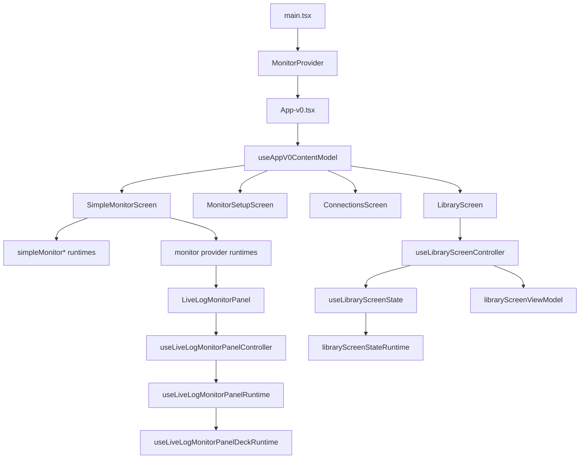
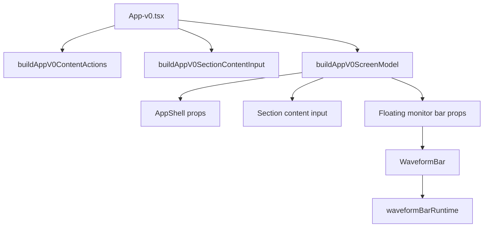
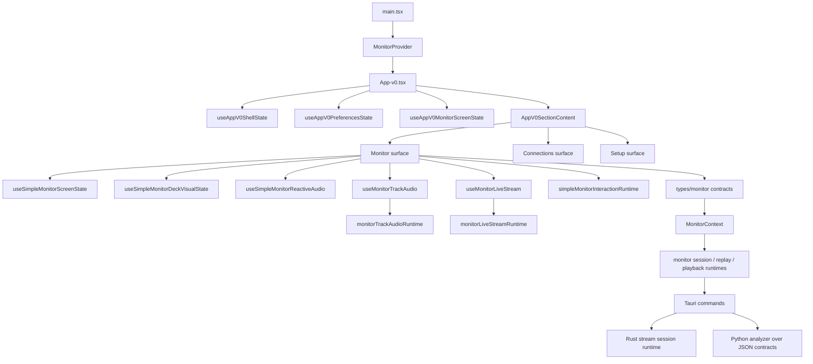
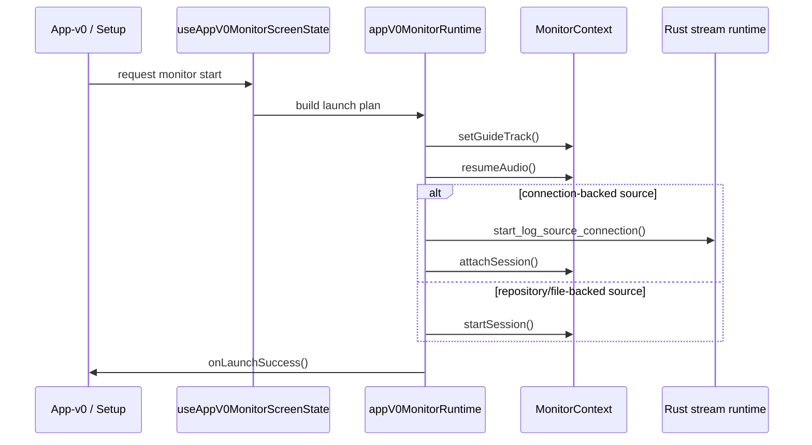
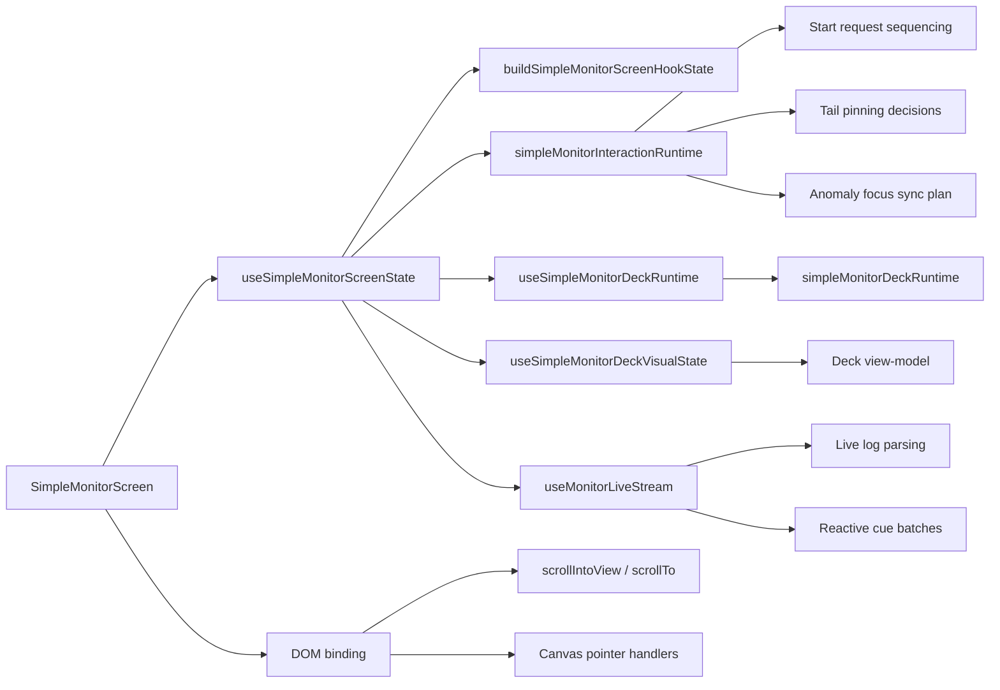
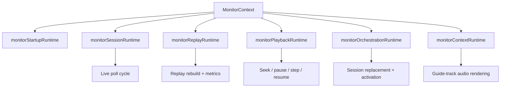
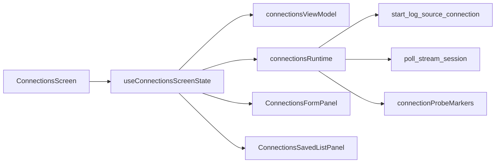
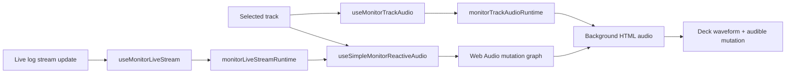

# Frontend Architecture

This document describes the active desktop frontend as it exists today.
It complements:

- [docs/architecture.md](architecture.md) for product-level architecture
- [docs/open-source-maintainer-guide.md](open-source-maintainer-guide.md) for cross-runtime maintainer context

## Active shell

The mounted desktop path is:

1. `desktop/src/main.tsx`
2. `MonitorProvider`
3. `App-v0.tsx`

`desktop/src/App.tsx` still exists as the legacy expert/simple shell and now delegates
section routing to `desktop/src/AppSectionContent.tsx` plus
`desktop/src/appSectionContentRuntime.ts`. It is not the mounted shell today, but it remains
an important compatibility path and test target.

Its shell-level visual responsibilities are now also split across:

- `desktop/src/components/AppTopbar.tsx`
- `desktop/src/components/AppMonitorOverview.tsx`
- `desktop/src/appShellRuntime.ts`
- `desktop/src/AppCurateSection.tsx`
- `desktop/src/AppSessionSection.tsx`

## Frontend responsibilities

The frontend owns:

- screen composition
- user flows for monitor, setup, connections, and library
- Web Audio playback and mutation
- transient view state
- browser/mock fallbacks around native commands

The frontend does **not** own:

- SQLite persistence
- filesystem access
- long-lived native stream sessions
- analyzer execution internals

## Current architectural direction

Recent refactors have been pushing large components toward:

- pure view-models for display state
- pure runtimes for monitor/orchestration behavior
- thinner screen components
- better testability around monitor startup, setup preferences, shell state, and stream mutation logic

Current emphasis for the next iterations:

- keep monitor-specific contracts inside `types/monitor.ts`
- isolate orchestration from screen rendering
- keep setup/preferences as a dedicated product surface, not mixed into live operations
- make the open-source entrypoints understandable for first-time contributors

## Key modules

### Shell and entrypoint

- `desktop/src/App-v0.tsx`
- `desktop/src/hooks/useAppV0ContentModel.ts`
- `desktop/src/AppV0SectionContent.tsx`
- `desktop/src/App.tsx`
- `desktop/src/AppSectionContent.tsx`
- `desktop/src/AppCurateSection.tsx`
- `desktop/src/AppSessionSection.tsx`
- `desktop/src/components/AppTopbar.tsx`
- `desktop/src/components/AppMonitorOverview.tsx`
- `desktop/src/appShellRuntime.ts`
- `desktop/src/hooks/useAppContentController.ts`
- `desktop/src/hooks/useAppContentShellState.ts`
- `desktop/src/hooks/useAppContentBootstrap.ts`
- `desktop/src/hooks/useAppContentNavigationActions.ts`
- `desktop/src/hooks/useAppContentSessionEffects.ts`
- `desktop/src/hooks/useAppCatalogActions.ts`
- `desktop/src/hooks/useAppCatalogImportActions.ts`
- `desktop/src/hooks/useAppCatalogLibraryActions.ts`
- `desktop/src/hooks/appCatalogActionsRuntime.ts`
- `desktop/src/hooks/appCatalogActionsTypes.ts`
- `desktop/src/hooks/useAppMonitorActions.ts`
- `desktop/src/hooks/useAppMonitorGuideActions.ts`
- `desktop/src/hooks/useAppMonitorSessionActions.ts`
- `desktop/src/hooks/appMonitorActionsTypes.ts`
- `desktop/src/hooks/useAppSelectionActions.ts`
- `desktop/src/appMonitorActionsRuntime.ts`
- `desktop/src/appSectionContentRuntime.ts`
- `desktop/src/hooks/useAppV0ShellState.ts`
- `desktop/src/hooks/useAppV0PreferencesState.ts`
- `desktop/src/hooks/useAppV0MonitorScreenState.ts`
- `desktop/src/hooks/useAppV0ScreenModel.ts`
- `desktop/src/hooks/appV0MonitorScreenStateRuntime.ts`
- `desktop/src/appV0MonitorOrchestration.ts`
- `desktop/src/appV0Preferences.ts`
- `desktop/src/appV0MonitorRuntime.ts`
- `desktop/src/appV0SectionViewModel.ts`
- `desktop/src/appV0ShellViewModel.ts`
- `desktop/src/appV0ViewModel.ts`
- `desktop/src/components/waveformBarRuntime.ts`

### Monitor surface

- `desktop/src/features/analyzer/components/LiveLogMonitorPanel.tsx`
- `desktop/src/features/analyzer/components/useLiveLogMonitorPanelController.tsx`
- `desktop/src/features/analyzer/components/useLiveLogMonitorPanelRuntime.tsx`
- `desktop/src/features/analyzer/components/liveLogMonitorPanelRuntimeBridge.ts`
- `desktop/src/features/analyzer/components/useLiveLogMonitorPanelRuntimeState.tsx`
- `desktop/src/features/analyzer/components/liveLogMonitorPanelRuntimeStateBridge.ts`
- `desktop/src/features/analyzer/components/useLiveLogMonitorPanelDeckRuntime.tsx`
- `desktop/src/features/analyzer/components/liveLogMonitorPanelDeckRuntimeBridge.ts`
- `desktop/src/features/analyzer/components/liveLogMonitorPanelDeckCallbacksRuntime.ts`
- `desktop/src/features/analyzer/components/useLiveLogMonitorDeckModel.tsx`
- `desktop/src/features/analyzer/components/liveLogMonitorDeckModelBridge.ts`
- `desktop/src/features/analyzer/components/liveLogMonitorPanelViewModelRuntime.ts`
- `desktop/src/features/analyzer/components/liveLogMonitorPanelRenderStateRuntime.ts`
- `desktop/src/features/analyzer/components/useLiveLogMonitorPanelAudioRuntime.ts`
- `desktop/src/features/analyzer/components/useLiveLogMonitorPanelAudioCore.ts`
- `desktop/src/features/analyzer/components/useLiveLogMonitorPanelAudioEffects.ts`
- `desktop/src/features/analyzer/components/liveLogMonitorPanelAudioInputRuntime.ts`
- `desktop/src/features/analyzer/components/liveLogMonitorPanelAudioTypes.ts`
- `desktop/src/features/analyzer/components/liveLogMonitorPanelAudioFeedbackRuntime.ts`
- `desktop/src/features/analyzer/components/LiveLogMonitorDeckSection.tsx`
- `desktop/src/features/analyzer/components/LiveLogMonitorLiveDeck.tsx`
- `desktop/src/features/analyzer/components/LiveWaveformCanvas.tsx`
- `desktop/src/features/analyzer/components/liveWaveformCanvasRuntime.ts`
- `desktop/src/features/analyzer/components/liveLogMonitorPlaylistEditorRuntime.ts`
- `desktop/src/features/analyzer/components/liveLogMonitorPlaylistViewState.ts`
- `desktop/src/features/analyzer/components/liveLogMonitorViewModelRuntime.ts`
- `desktop/src/features/analyzer/components/liveLogMonitorInteractionRuntime.ts`
- `desktop/src/features/analyzer/components/liveLogMonitorControlRuntime.ts`
- `desktop/src/features/analyzer/components/liveLogMonitorAudioCleanupRuntime.ts`
- `desktop/src/features/analyzer/components/liveLogMonitorPreferencesRuntime.ts`
- `desktop/src/features/analyzer/components/liveLogMonitorBackgroundRuntime.ts`
- `desktop/src/features/analyzer/components/liveLogMonitorMutationRuntime.ts`
- `desktop/src/features/analyzer/components/liveLogMonitorCuePlaybackRuntime.ts`
- `desktop/src/features/analyzer/components/liveLogMonitorStreamUpdateRuntime.ts`
- `desktop/src/features/analyzer/components/liveLogMonitorActionRuntime.ts`
- `desktop/src/features/analyzer/components/liveLogMonitorSequencerRuntime.ts`
- `desktop/src/features/analyzer/components/liveLogMonitorCueExecutionRuntime.ts`
- `desktop/src/features/analyzer/components/liveLogMonitorCueScheduleRuntime.ts`
- `desktop/src/features/analyzer/components/liveLogMonitorBeatRuntime.ts`
- `desktop/src/features/analyzer/components/liveLogMonitorUpdateDerivationRuntime.ts`
- `desktop/src/features/analyzer/components/liveLogMonitorSampleRuntime.ts`
- `desktop/src/features/analyzer/components/liveLogMonitorBackgroundDeckRuntime.ts`
- `desktop/src/features/analyzer/components/liveLogMonitorAudioRuntime.ts`
- `desktop/src/features/analyzer/components/liveLogMonitorPanelRuntime.ts`
- `desktop/src/features/analyzer/components/liveLogMonitorViewModel.ts`
- `desktop/src/features/analyzer/components/TrackCueList.tsx`
- `desktop/src/features/analyzer/components/TrackSavedLoopList.tsx`
- `desktop/src/features/analyzer/components/useLiveLogMonitorResetActions.ts`
- `desktop/src/features/analyzer/components/useLiveLogMonitorBackgroundLifecycle.ts`
- `desktop/src/features/analyzer/components/useLiveLogMonitorBackgroundDeckControl.ts`
- `desktop/src/features/analyzer/components/useLiveLogMonitorAudioBootstrap.ts`
- `desktop/src/features/analyzer/components/useLiveLogMonitorBackgroundAudioEngine.ts`
- `desktop/src/features/analyzer/components/useLiveLogMonitorAuxPlayback.ts`
- `desktop/src/features/analyzer/components/useLiveLogMonitorSampleBank.ts`
- `desktop/src/features/analyzer/components/useLiveLogMonitorSurfaceSync.ts`
- `desktop/src/features/simple/SimpleMonitorScreen.tsx`
- `desktop/src/features/simple/SimpleMonitorActiveView.tsx`
- `desktop/src/features/simple/ConnectionsScreen.tsx`
- `desktop/src/features/simple/ConnectionsHeroPanel.tsx`
- `desktop/src/features/simple/MonitorActiveDeckSection.tsx`
- `desktop/src/features/simple/MonitorActiveFooter.tsx`
- `desktop/src/features/simple/simpleMonitorActiveViewRuntime.ts`
- `desktop/src/features/simple/useSimpleMonitorScreenState.ts`
- `desktop/src/features/simple/useSimpleMonitorScreenController.ts`
- `desktop/src/features/simple/useSimpleMonitorAnomalyFilterState.ts`
- `desktop/src/features/simple/useConnectionsFormController.ts`
- `desktop/src/features/simple/simpleMonitorScreenOrchestrationRuntime.ts`
- `desktop/src/features/simple/simpleMonitorScreenHookArgsRuntime.ts`
- `desktop/src/features/simple/simpleMonitorScreenSectionsRuntime.ts`
- `desktop/src/features/simple/simpleMonitorScreenStateRuntime.ts`
- `desktop/src/features/simple/simpleMonitorScreenSlicesRuntime.ts`
- `desktop/src/features/simple/useSimpleMonitorDeckRuntime.ts`
- `desktop/src/features/simple/useSimpleMonitorDeckController.ts`
- `desktop/src/features/simple/useSimpleMonitorDeckLiveController.ts`
- `desktop/src/features/simple/simpleMonitorDeckRuntimeTypes.ts`
- `desktop/src/features/simple/simpleMonitorDeckRuntime.ts`
- `desktop/src/features/simple/useSimpleMonitorSourceSelector.ts`
- `desktop/src/features/simple/useSimpleMonitorDeckVisualState.ts`
- `desktop/src/features/simple/monitorDeckCanvas.ts`
- `desktop/src/features/simple/monitorDeckOverviewCanvas.ts`
- `desktop/src/features/simple/monitorDeckMainCanvas.ts`
- `desktop/src/features/simple/monitorDeckMainCanvasRuntime.ts`
- `desktop/src/features/simple/useSimpleMonitorReactiveAudio.ts`
- `desktop/src/features/simple/simpleMonitorReactiveAudioRuntime.ts`
- `desktop/src/features/simple/useMonitorLiveStream.ts`
- `desktop/src/features/simple/monitorLiveStreamSignalRuntime.ts`
- `desktop/src/features/simple/monitorLiveStreamStateRuntime.ts`
- `desktop/src/features/simple/useMonitorTrackAudio.ts`
- `desktop/src/features/simple/simpleMonitorInteractionRuntime.ts`
- `desktop/src/features/simple/simpleMonitorScreenRuntime.ts`
- `desktop/src/features/simple/simpleMonitorDeckRuntime.ts`
- `desktop/src/features/simple/monitorLiveStreamRuntime.ts`
- `desktop/src/features/simple/monitorTrackAudioRuntime.ts`
- `desktop/src/features/simple/monitorTrackMutationRuntime.ts`
- `desktop/src/features/simple/proMonitorScreenRuntime.ts`
- `desktop/src/features/monitor/MonitorContext.tsx`
- `desktop/src/features/monitor/monitorContextTypes.ts`
- `desktop/src/features/monitor/monitorContextRuntime.ts`
- `desktop/src/features/monitor/monitorGuideTrackDecodeRuntime.ts`
- `desktop/src/features/monitor/monitorProviderGuideTrackRuntime.ts`
- `desktop/src/features/monitor/monitorProviderLiveRuntime.ts`
- `desktop/src/features/monitor/monitorProviderSessionRuntime.ts`
- `desktop/src/features/monitor/monitorProviderPlaybackSessionRuntime.ts`
- `desktop/src/features/monitor/monitorReplayTickRuntime.ts`
- `desktop/src/features/monitor/monitorReplayHydrationRuntime.ts`
- `desktop/src/features/monitor/monitorProviderStartRuntime.ts`
- `desktop/src/features/monitor/monitorProviderPlaybackControlsRuntime.ts`
- `desktop/src/features/monitor/useMonitorProviderGuideTrack.ts`
- `desktop/src/features/monitor/useMonitorProviderPlaybackControls.ts`
- `desktop/src/features/monitor/useMonitorProviderContextValue.ts`
- `desktop/src/features/monitor/useMonitorProviderController.ts`
- `desktop/src/features/monitor/useMonitorProviderState.ts`
- `desktop/src/features/monitor/monitorSessionRuntime.ts`
- `desktop/src/features/monitor/monitorReplayRuntime.ts`
- `desktop/src/features/monitor/monitorPlaybackRuntime.ts`
- `desktop/src/features/monitor/monitorStartupRuntime.ts`
- `desktop/src/features/monitor/monitorOrchestrationRuntime.ts`

### Shared monitor contracts

- `desktop/src/types/monitor.ts`
- `desktop/src/features/monitor/monitorContextTypes.ts`

These modules now isolate stream-session, live-log, and active-monitor contracts from the
broader library/catalog domain. `desktop/src/types/library.ts` keeps compatibility through
type re-exports while the monitor flow gradually migrates to the dedicated contracts.

### Setup and persistent preferences

- `desktop/src/features/simple/MonitorSetupScreen.tsx`
- `desktop/src/features/simple/monitorSetupViewModel.ts`
- `desktop/src/features/simple/monitorSetupPreferences.ts`
- `desktop/src/features/simple/useMonitorDeckControls.ts`
- `desktop/src/features/simple/useMonitorSetupProfile.ts`
- `desktop/src/features/simple/useMonitorSetupScreenModel.ts`
- `desktop/src/features/simple/MonitorSetupHeroPanel.tsx`
- `desktop/src/features/simple/MonitorSetupRackSection.tsx`
- `desktop/src/features/simple/useSimpleModeLibraryPreview.ts`
- `desktop/src/features/simple/monitorSetupProfileRuntime.ts`
- `desktop/src/features/simple/monitorSetupScreenRuntime.tsx`
- `desktop/src/features/simple/monitorDeckControlsRuntime.ts`

### Connections

- `desktop/src/features/simple/ConnectionsScreen.tsx`
- `desktop/src/features/simple/useConnectionsScreenState.ts`
- `desktop/src/features/simple/useConnectionTailController.ts`
- `desktop/src/features/simple/useConnectionTestController.ts`
- `desktop/src/features/simple/ConnectionsFormPanel.tsx`
- `desktop/src/features/simple/ConnectionsSavedListPanel.tsx`
- `desktop/src/features/simple/ConnectionsSavedRow.tsx`
- `desktop/src/features/simple/ConnectionsTailConsole.tsx`
- `desktop/src/features/simple/connectionsViewModel.ts`
- `desktop/src/features/simple/connectionsRuntime.ts`
- `desktop/src/features/simple/connectionsProbeRuntime.ts`
- `desktop/src/features/simple/connectionsScreenHookRuntime.ts`
- `desktop/src/features/simple/connectionsScreenStateRuntime.ts`
- `desktop/src/features/simple/connectionsSavedListViewModel.ts`
- `desktop/src/features/simple/connectionProbeMarkers.ts`

### Library

- `desktop/src/features/library/LibraryScreen.tsx`
- `desktop/src/features/library/useLibraryScreenController.tsx`
- `desktop/src/features/library/useLibraryScreenImportActions.ts`
- `desktop/src/features/library/useLibraryScreenToolbarActions.tsx`
- `desktop/src/features/library/LibraryTabStrip.tsx`
- `desktop/src/features/library/libraryScreenStateRuntime.ts`
- `desktop/src/features/library/libraryScreenControllerTypes.ts`
- `desktop/src/features/library/libraryScreenTypes.ts`
- `desktop/src/features/library/libraryScreenViewModel.ts`
- `desktop/src/features/library/libraryScreenToolbarRuntime.ts`
- `desktop/src/features/library/libraryPlaylistsViewModel.ts`
- `desktop/src/features/library/libraryConnectionsViewModel.ts`
- `desktop/src/features/library/libraryBaseAssetsViewModel.ts`
- `desktop/src/features/library/librarySourcesViewModel.ts`
- `desktop/src/features/library/libraryTracksViewModel.ts`
- `desktop/src/features/library/useLibraryScreenState.ts`
- `desktop/src/features/library/components/LibraryBaseAssetsListPanel.tsx`
- `desktop/src/features/library/components/LibraryConnectionsListPanel.tsx`
- `desktop/src/features/library/components/LibraryPlaylistsPanel.tsx`
- `desktop/src/features/library/components/LibrarySourcesListPanel.tsx`
- `desktop/src/features/library/components/LibraryTracksListPanel.tsx`
- `desktop/src/hooks/libraryRuntime.ts`
- `desktop/src/hooks/useLibraryBootstrap.ts`
- `desktop/src/hooks/useLibraryMutationActions.ts`
- `desktop/src/hooks/useLibraryTrackMutationActions.ts`
- `desktop/src/hooks/useLibraryPlaylistMutationActions.ts`
- `desktop/src/hooks/libraryMutationActionsTypes.ts`
- `desktop/src/features/library/components/ImportTrackForm.tsx`
- `desktop/src/features/library/components/ImportRepositoryForm.tsx`
- `desktop/src/features/library/components/ImportBaseAssetForm.tsx`
- `desktop/src/features/library/components/ImportCompositionForm.tsx`

### Sessions

- `desktop/src/features/session/SessionScreen.tsx`
- `desktop/src/features/session/useSessionScreenController.ts`
- `desktop/src/features/session/useSessionScreenActions.ts`
- `desktop/src/features/session/useSessionScreenEffects.ts`
- `desktop/src/features/session/sessionScreenViewModel.ts`
- `desktop/src/features/session/sessionDisplayFormatting.ts`
- `desktop/src/features/session/sessionDisplayBaseRuntime.ts`
- `desktop/src/features/session/sessionDisplaySourceRuntime.ts`
- `desktop/src/features/session/SessionScreenHeader.tsx`
- `desktop/src/features/session/SessionScreenNoticeStack.tsx`
- `desktop/src/features/session/SessionScreenPanels.tsx`
- `desktop/src/features/session/SessionBoothPanel.tsx`
- `desktop/src/features/session/SessionSetupPanel.tsx`
- `desktop/src/features/session/SessionSavedSessionsPanel.tsx`
- `desktop/src/features/session/SessionTemplatePresetStrip.tsx`
- `desktop/src/features/session/SessionWorkflowStrip.tsx`
- `desktop/src/features/session/SessionSetupSelectionGrid.tsx`
- `desktop/src/features/session/SessionCreateFooter.tsx`
- `desktop/src/features/session/SessionSavedSessionCard.tsx`
- `desktop/src/features/session/SessionReplayBookmarkPanel.tsx`
- `desktop/src/features/session/sessionScreenRuntime.ts`
- `desktop/src/features/session/sessionBoothViewModel.ts`
- `desktop/src/features/session/sessionDisplay.ts`

### Inspect surface

- `desktop/src/features/inspect/InspectScreen.tsx`
- `desktop/src/features/inspect/InspectTrackView.tsx`
- `desktop/src/features/inspect/InspectRepositoryView.tsx`
- `desktop/src/features/inspect/InspectBaseAssetView.tsx`
- `desktop/src/features/inspect/InspectContextBar.tsx`

## Recent refactor notes

- `desktop/src/features/analyzer/components/LiveWaveformCanvas.tsx` is now a thinner React shell. Canvas resize, analyser sampling, and frame drawing moved to `liveWaveformCanvasRuntime.ts`.
- `desktop/src/features/simple/monitorDeckCanvas.ts` is now only a public facade. The overview strip and the main deck renderer live in `monitorDeckOverviewCanvas.ts` and `monitorDeckMainCanvas.ts`.
- `desktop/src/features/session/sessionDisplay.ts` is now also a facade. Formatting, base-track lookup, and source/bed-url resolution live in dedicated runtimes.
- `desktop/src/features/simple/useConnectionsScreenState.ts` now focuses on form/list orchestration. Live tail polling moved to `useConnectionTailController.ts`, and adapter probe feedback moved to `useConnectionTestController.ts`.
- `desktop/src/features/monitor/MonitorContext.tsx` now uses `useMonitorProviderState.ts` as the shared state/ref scaffold, leaving provider composition closer to orchestration-only code.
- `desktop/src/features/analyzer/components/useLiveLogMonitorPanelRuntime.tsx` is now mostly a composition shell. Orchestrator, lifecycle, and deck-runtime input assembly moved to `liveLogMonitorPanelRuntimeBridge.ts`.
- `desktop/src/features/analyzer/components/useLiveLogMonitorPanelRuntimeState.tsx` is now a thin assembler over `buildLiveLogMonitorViewModel`, `useLiveLogMonitorPanelAudioRuntime`, and `useLiveLogMonitorReplayState`, with pure input/output shaping in `liveLogMonitorPanelRuntimeStateBridge.ts`.
- `desktop/src/features/analyzer/components/useLiveLogMonitorPanelDeckRuntime.tsx` is now a lighter shell over session actions, operator actions, deck model, and final render-state assembly, with callback shaping split into `liveLogMonitorPanelDeckCallbacksRuntime.ts` and the remaining prop wiring in `liveLogMonitorPanelDeckRuntimeBridge.ts`.
- `desktop/src/features/analyzer/components/useLiveLogMonitorDeckModel.tsx` now delegates panel/deck/scene/routing/live-props input shaping to `liveLogMonitorDeckModelBridge.ts`, leaving the hook focused on memoized composition.
- `desktop/src/features/analyzer/components/useLiveLogMonitorPanelAudioRuntime.ts` is now a thin composition layer over `useLiveLogMonitorPanelAudioCore.ts` and `useLiveLogMonitorPanelAudioEffects.ts`, while `liveLogMonitorPanelAudioInputRuntime.ts` and `liveLogMonitorPanelAudioFeedbackRuntime.ts` keep the pure shaping/warning behavior testable outside React.
- `desktop/src/features/session/SessionScreen.tsx` now delegates prop assembly for its header, notice stack, booth, and panel surfaces to `sessionScreenViewModel.ts`.
- `desktop/src/features/session/SessionSetupPanel.tsx` and `SessionSavedSessionsPanel.tsx` now delegate their large visual sections to dedicated subcomponents, making session setup and replay surfaces easier to maintain and test in isolation.
- This keeps the visual monitor path closer to the same architecture already used in library, session, and live-monitor audio: shell + controller/runtime + focused tests.
- `desktop/src/features/inspect/InspectEmptyState.tsx`

## Section ownership

The current frontend is intentionally split into three layers:

1. **Shell composition**
   - section selection
   - language / skin preferences
   - sidebar status
   - high-level monitor launch wiring
2. **Feature surfaces**
   - monitor
   - setup
   - connections
   - library
3. **Pure runtimes / view-models**
   - monitor playback and polling
   - anomaly focus and tail sync
   - connection draft serialization
   - library tabs / toolbar / empty-state derivation
   - visual deck derivations

This is the core rule contributors should preserve: avoid re-growing screen files by pushing logic downward into pure, testable modules.

Recent examples of that direction:

- `useAppV0ContentModel.ts` now owns the section/model assembly used by `App-v0.tsx`, leaving the mounted shell as provider composition plus final render
- `useAppV0ScreenModel.ts` now owns the final App-v0 shell/content model assembly, leaving `useAppV0ContentModel.ts` closer to dependency orchestration than view-model construction
- `appSectionContentRuntime.ts` now owns the pure visibility rules for the legacy `App.tsx` section selector, while `AppSectionContent.tsx` keeps the actual lazy surface composition
- `useAppCatalogActions.ts` now owns the legacy shell catalog/import/update/delete handlers so `App.tsx` no longer mixes section composition with track/repository mutation flows
- `useAppContentController.ts` now keeps its public shell contract while delegating analyzer/bootstrap state to `useAppContentBootstrap.ts`, UI shell preferences/state to `useAppContentShellState.ts`, navigation/background actions to `useAppContentNavigationActions.ts`, and session-bookmark refresh side effects to `useAppContentSessionEffects.ts`
- `useAppMonitorActions.ts` is now a thin composition hook over `useAppMonitorGuideActions.ts` and `useAppMonitorSessionActions.ts`, while `appMonitorActionsRuntime.ts` keeps pure replay/session persistence derivations testable outside React
- `SimpleMonitorScreen.tsx` is now a thin surface selector. The orchestration, launch-state, and deck-state responsibilities live in `useSimpleMonitorScreenState.ts` plus dedicated simple-monitor runtimes
- `useSimpleMonitorScreenState.ts` now delegates anomaly-filter state to `useSimpleMonitorAnomalyFilterState.ts` and explicit launch/deck slice shaping to `simpleMonitorScreenSlicesRuntime.ts`, keeping the monitor shell hook closer to orchestration than object assembly
- `useSimpleMonitorScreenController.ts` now owns the launch/deck/anomaly composition beneath `useSimpleMonitorScreenState.ts`, so the public simple-monitor hook mostly assembles the final active/idle view state
- `useSimpleMonitorDeckController.ts` now owns the sub-hook composition beneath `useSimpleMonitorDeckRuntime.ts`, leaving the deck runtime as a stable facade over the assembled deck state
- `useMonitorSetupProfile.ts`, `monitorSetupProfileRuntime.ts`, and `monitorDeckControlsRuntime.ts` now isolate setup-profile composition plus persisted deck-control IO from the setup screen shell
- `LibraryScreen.tsx` now delegates state orchestration, toolbar actions, import/delete side effects, and connection refresh behavior to `useLibraryScreenController.tsx`, while `LibraryTabStrip.tsx` owns tab rendering
- `useLibraryScreenController.tsx` is now a lighter composition hook over `useLibraryScreenState.ts`, `useLibraryScreenImportActions.ts`, `useLibraryScreenToolbarActions.tsx`, and `libraryScreenToolbarRuntime.ts`
- `LiveLogMonitorPanel.tsx` is now a thin composition shell over `useLiveLogMonitorPanelController.tsx` and `useLiveLogMonitorPanelRuntime.tsx`, making monitor runtime wiring directly unit-testable
- `useLibrary.ts` now acts as a thin composition hook over `useLibraryBootstrap.ts` and `useLibraryMutationActions.ts`, while the mutation facade delegates track flows to `useLibraryTrackMutationActions.ts` and playlist flows to `useLibraryPlaylistMutationActions.ts`
- `useSessionScreenController.ts` now delegates command handlers to `useSessionScreenActions.ts` and monitor/audio/event side effects to `useSessionScreenEffects.ts`
- `useLiveLogMonitorPanelRuntimeState.tsx` now delegates the audio/background/reset/sample/sync stack to `useLiveLogMonitorPanelAudioRuntime.ts`, whose core/effects split keeps the panel state hook free from deeper audio wiring details

## Current refactor status

Areas that are now structurally healthy:

- mounted shell routing and section selection
- monitor provider runtime/orchestration
- simple monitor launch/deck/view-model layer
- live monitor panel controller/runtime shell
- session screen composition
- library screen controller and tab shell

Areas that still carry the most debt:

- `desktop/src/features/analyzer/components/useLiveLogMonitorPanelRuntimeState.tsx`
- `desktop/src/features/analyzer/components/WaveformPlaceholder.tsx`
- `desktop/src/features/analyzer/components/LiveWaveformCanvas.tsx`
- `desktop/src/features/session/useSessionScreenController.ts`
- `desktop/src/hooks/useLibrary.ts`
- `desktop/src/features/simple/monitorDeckCanvas.ts`

Those modules should be the next extraction targets before broad visual redesign work or public contributor onboarding expands.
- `useAppSelectionActions.ts` now owns legacy shell selection, inspection, and simple-monitor navigation callbacks so `App.tsx` passes stable feature actions instead of large inline closures
- `AppTopbar.tsx`, `AppMonitorOverview.tsx`, and `appShellRuntime.ts` now isolate legacy shell branding/control rendering plus now-playing visibility from `App.tsx`
- `AppCurateSection.tsx` and `AppSessionSection.tsx` now isolate library/session screen wiring from `AppSectionContent.tsx`, leaving the compatibility router closer to pure section selection
- `monitorLiveStreamRuntime.ts` now owns reset-state and hook-state snapshot builders for live tail state
- `liveLogMonitorSessionRuntime.ts` now also owns live-monitor start reset defaults and beat-clock / beat-looper boot planning so `handleStart` keeps less session-start policy inline
- `connectionsRuntime.ts` now owns the final hook-state snapshot returned by `useConnectionsScreenState`
- `connectionsScreenStateRuntime.ts` now owns the async connection CRUD/test orchestration used by `useConnectionsScreenState`
- `simpleMonitorReactiveAudioRuntime.ts` now owns imperative graph automation steps and the hook-state snapshot for reactive deck audio
- `monitorContextValue.ts` now owns the final provider snapshot returned by `MonitorContext`
- `monitorGuideTrackDecodeRuntime.ts` now owns guide-track decode caching, fetch/IPC fallback, and mono PCM normalization
- `monitorProviderGuideTrackRuntime.ts` now owns provider-level active-template changes plus guide-track queue and seek controls
- `monitorProviderLiveRuntime.ts` now owns provider-level stream update emission, persisted poll-index advancement, and poll-loop wiring
- `monitorProviderSessionRuntime.ts` now owns provider-level start/attach orchestration for live sessions before control returns to `MonitorContext`
- `monitorProviderPlaybackSessionRuntime.ts` now owns provider-level replay-session orchestration, including activation, audio bootstrap, and optional hydration wiring
- `SessionScreenHeader.tsx`, `SessionScreenNoticeStack.tsx`, and `SessionScreenPanels.tsx` now keep session-shell rendering separate from the `SessionScreen.tsx` orchestration flow
- `monitorProviderStartRuntime.ts` now owns the shared live-session start wiring reused by `startSession` and `attachSession`
- `monitorProviderStartRuntime.ts` now also owns the reusable base live-start input snapshot shared by `startSession` and `attachSession`, so `MonitorContext.tsx` keeps less provider wiring inline
- `monitorProviderPlaybackControlsRuntime.ts` now owns provider-level playback guards and guide-track-sync wiring for seek, pause, resume, and stepping
- `liveLogMonitorAudioRuntime.ts` now owns pure background-mutation derivation and managed WAV-blob playback helpers for the analyzer live monitor
- `liveLogMonitorPanelRuntime.ts` now owns pure tail/anomaly derivations and synchronized tail-row shaping for the analyzer live monitor panel
- `liveLogMonitorViewModel.ts` now owns pure deck/playlist/replay/adapter derivations for the analyzer live monitor so the panel keeps less orchestration-only display logic
- `liveLogMonitorPlaylistEditorRuntime.ts` now owns pure base-playlist editing operations so deck setup changes are reusable and directly testable
- `liveLogMonitorPlaylistViewState.ts` now owns playlist summary/editor/option derivation for the live monitor deck
- `liveLogMonitorInteractionRuntime.ts` now owns replay bookmark jump and anomaly-trace selection state so scrubbing logic is no longer embedded directly in the panel body
- `liveLogMonitorControlRuntime.ts` now owns live-monitor start warnings, session id creation, failure formatting, and beat-looper defaults
- `liveLogMonitorAudioCleanupRuntime.ts` now owns stop-time graph teardown for the live monitor audio chain
- `liveLogMonitorPreferencesRuntime.ts` now owns repo-switch reset defaults, guide-track playlist seeding, and persisted monitor-preferences payload shaping for the live monitor panel
- `liveLogMonitorBackgroundRuntime.ts` now owns pure background-deck lifecycle, transition scheduling, and start-plan derivation so `LiveLogMonitorPanel.tsx` keeps only the imperative audio-node wiring
- `liveLogMonitorMutationRuntime.ts` now owns reactive mutation resolution and background-automation plan derivation so `LiveLogMonitorPanel.tsx` no longer mixes DSP formulas with `AudioParam` scheduling
- `liveLogMonitorCuePlaybackRuntime.ts` now owns cue-layer playback planning, audible-voice filtering, and sample/track-slice/oscillator routing decisions so `LiveLogMonitorPanel.tsx` keeps less arrangement-only logic inline
- `liveLogMonitorStreamUpdateRuntime.ts` now owns known-component merging, recent-history derivation, tail-window selection, and explanation-selection rules so `onStreamUpdate` keeps less UI-state derivation inline
- `liveLogMonitorActionRuntime.ts` now owns stop-reset defaults, bounce filename derivation, and bookmark/replay-feedback profile selection so `LiveLogMonitorPanel.tsx` keeps less action-policy logic inline
- `liveLogMonitorSequencerRuntime.ts` now owns sequencer preview batching and preview-volume derivation so `handleSequencerStepFire` keeps less timing-policy logic inline
- `liveLogMonitorCueExecutionRuntime.ts` now owns external cue-layer gating, bounce-window accumulation, and beat-locked cue event timing so `playWithCurrentEngine` keeps less transport orchestration inline
- `liveLogMonitorCueScheduleRuntime.ts` now owns cue offset/duration/playback-rate heuristics and Web Audio cue scheduling wrappers so the panel keeps less per-voice transport math inline
- `liveLogMonitorBeatRuntime.ts` now owns beat-clock subdivision timing and beat-looper pulse scheduling so the panel keeps less tempo-runtime wiring inline
- `liveLogMonitorUpdateDerivationRuntime.ts` now owns known-component expansion, routed cue derivation, current-track lookup, and mutation explanation derivation so `onStreamUpdate` keeps less domain logic inline
- `liveLogMonitorSampleRuntime.ts` now owns managed sample-source resolution plus fetch/decode helpers so sample-bank loading logic is no longer embedded in the panel effect body
- `liveLogMonitorBackgroundDeckRuntime.ts` now owns background-deck snapshots and guide-track buffer cache helpers so lifecycle/control code keeps less low-level deck plumbing inline
- `useLiveLogMonitorResetActions.ts` now owns repository/start/stop reset application so the panel keeps less repeated state-reset wiring inline
- `useLiveLogMonitorBackgroundLifecycle.ts` now owns the background-deck lifecycle effect so the panel keeps less live/suspend/start/restart orchestration inline
- `useLiveLogMonitorBackgroundDeckControl.ts` now owns guide-track start/stop/transition orchestration so the panel keeps less background-deck transport wiring inline
- `useLiveLogMonitorAudioBootstrap.ts` now owns shared/local audio-context boot plus master/analyser graph initialization so the panel keeps less audio-session startup wiring inline
- `useLiveLogMonitorBackgroundAudioEngine.ts` now owns background-bus initialization plus reactive mutation automation so the panel keeps less Web Audio graph control inline
- `useLiveLogMonitorAuxPlayback.ts` now owns rendered-blob playback fallback plus panel test-tone playback so the panel keeps less one-shot cue-output wiring inline
- `useLiveLogMonitorSampleBank.ts` now owns the sample-bank loading lifecycle so `LiveLogMonitorPanel.tsx` keeps less async resource-loading code inline
- `useLiveLogMonitorSurfaceSync.ts` now owns monitor preference persistence plus volume/scroll/style synchronization effects so the panel keeps less surface-only effect wiring inline
- `useLiveLogMonitorSurfaceState.ts` now owns the local refs/state scaffold for the live monitor so `LiveLogMonitorPanel.tsx` keeps less declaration noise inline
- `useLiveLogMonitorReplayState.ts` now owns replay bookmark + feedback wiring so `LiveLogMonitorPanel.tsx` keeps less replay interaction state inline
- `useLiveLogMonitorDeckModel.tsx` now owns the deck presentation assembly so `LiveLogMonitorPanel.tsx` keeps less `useMemo`-driven prop composition inline
- `useLiveLogMonitorLifecycle.ts` now owns repo-reset, guide-track seed, blob cleanup, and stream subscription effects so `LiveLogMonitorPanel.tsx` keeps less lifecycle/orchestration wiring inline
- `useLiveLogMonitorSessionActions.ts` now owns live start/stop/bounce operator actions so `LiveLogMonitorPanel.tsx` keeps less transport-startup and teardown policy inline
- `useLiveLogMonitorOperatorActions.ts` now owns volume mute/restore, replay feedback application, bookmark jumps, and trace explanation selection so the panel keeps less operator-interaction policy inline
- `useMonitorProviderGuideTrack.ts` now owns guide-track template, queue, seek, and deferred reload wiring so `MonitorContext.tsx` keeps less decode/playlist orchestration inline
- `useMonitorProviderPlaybackControls.ts` now owns replay pause/resume/seek/step wiring so `MonitorContext.tsx` keeps less playback-control plumbing inline
- `LiveLogMonitorDeckSection.tsx` now owns active-deck composition, mutation trace, and sequencer wiring for the analyzer live monitor
- `LiveLogMonitorLiveDeck.tsx` now owns the live deck composition block so `LiveLogMonitorPanel.tsx` no longer renders every live subsection inline
- `LiveWaveformCanvas.tsx` now isolates the analyser-driven waveform rendering loop from the broader live monitor orchestration
- `appV0MonitorScreenStateRuntime.ts` now owns pure App-v0 monitor-shell derivations and orchestrator assembly so the hook mostly wires dependencies
- `simpleMonitorScreenOrchestrationRuntime.ts` now owns the assembly of launch input, deck input, and final hook-state args for the simple monitor flow
- `InspectTrackView.tsx`, `InspectRepositoryView.tsx`, and `InspectBaseAssetView.tsx` now split the inspect surface by asset mode, leaving `InspectScreen.tsx` as a lightweight selector/composer
- `TrackCueList.tsx` and `TrackSavedLoopList.tsx` now isolate repeated performance-edit UI blocks from `TrackPerformancePanel.tsx`

## Shell composition flow

## Runtime flow

## Monitor startup flow

## Monitor interaction flow

## Monitor runtime internals

## Connections flow

## Audio + deck flow

## Frontend quality goals

When touching the frontend, contributors should generally prefer:

- extracted pure helpers instead of enlarging screens further
- injected dependencies for monitor orchestration
- localized view-model tests over brittle DOM-only tests
- clear language consistency across English and Spanish strings
- configuration grouped in `Setup` rather than scattered inline in operational panels
- explicit translation-copy injection for selection and setup helpers

## Known pressure points

These files are still significant complexity hotspots:

- `desktop/src/features/monitor/MonitorContext.tsx`
- `desktop/src/features/simple/useSimpleMonitorScreenState.ts`
- `desktop/src/features/simple/useConnectionsScreenState.ts`

`App-v0.tsx`, `SimpleMonitorScreen.tsx`, and `ConnectionsScreen.tsx` have already been reduced substantially and now act primarily as composition shells.
`App.tsx` has also been reduced again and now focuses on shell composition, high-level navigation, and status rendering rather than catalog or monitor mutation details.

## Testing direction

The preferred testing split is:

- provider and orchestration flows through focused React tests
- pure monitor runtime coverage through unit tests
- connection form / saved list behavior through feature tests
- setup and deck preference behavior through view-model tests

Areas that still deserve more integration coverage:

- create connection → test connection → attach session → open live monitor
- stop / replay / re-attach monitor loops
- setup preference edits across skins and language changes
