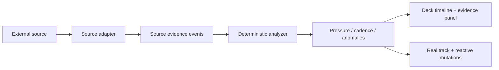

# Signal Streams Roadmap

**Status:** Product and architecture direction  
**Updated:** July 11, 2026

## Current Implementation Snapshot

As of this update, Maia already moved beyond a pure log-only product in the app surface:

- `CodeProjects` exists in the Library as a first non-log source-management surface.
- `desktop/src/types/codeProject.ts` defines `CodeProject`, `CodeProjectSonarQubeConfig`, and upsert draft contracts.
- `desktop/src/features/library/useCodeProjectsState.ts` calls native Tauri commands to list, create, update, delete, and test SonarQube-backed projects.
- `desktop/src-tauri/src/main.rs` owns the `code_projects` CRUD commands and the SonarQube API test endpoint.
- `desktop/src-tauri/src/main.rs` also contains the current SonarQube polling branch inside `poll_stream_session`.
- `database/schema.sql` includes `code_projects`.

Important limitations remain:

- SonarQube findings are currently converted to log-shaped text rows via `format_sonarqube_issue_as_log_line`.
- `code_projects.sonarqube_auth_token` is stored in SQLite plaintext, explicitly documented as a security limitation.
- The legacy `log_source_connections` table still exists and should not be renamed without a tested migration.
- The public monitor contracts still use names such as `LiveLogStreamUpdate`, `parsedLines`, and `logTailChunk`.
- The next product step is not more UI chrome; it is reliable CodeProject → monitor launch → poll → evidence row → audio/deck correlation.

## Intent

Maia should not be framed as a log monitor only.
Logs are one important source, but the product architecture is stronger if every input is treated as a **signal stream**: a time-ordered flow of observations that can expose pressure, drift, quality degradation, risk, or anomalies.

The listening model stays the same:

1. A real track or playlist is the stable musical bed.
2. A technical signal stream changes the mix only when the signal justifies it.
3. The deck shows the source evidence, markers, timeline, and replay state.
4. The analyzer stays deterministic and source-aware only through explicit metadata.

## Product Reframe

Current phrasing often says:

- logs
- log source
- log tail
- live log monitor
- repository or log analysis

The target product vocabulary should be:

- signal source
- stream input
- signal timeline
- live signal monitor
- source evidence
- anomaly marker
- stream pressure
- source adapter

Logs remain a first-class signal source, but not the only one.

## Architecture Principle

Every adapter should normalize source-specific data into the same internal flow:



The adapter may ingest logs, SonarQube issues, CI events, metric samples, queue depth, test results, incidents, security findings, or business-process events.
After ingestion, the monitor should not care whether the original source was a file, cloud service, repo scanner, or API.

## Proposed Domain Terms

| Current term | Better term | Notes |
|---|---|---|
| `LogSourceConnection` | `StreamInputConnection` | Already documented as the desired direction. |
| `log_source_connections` | `stream_input_connections` | Needs migration/backward compatibility. |
| `repo_analysis` | `signal_analysis` or `source_analysis` | Keep current enum for compatibility; add a new type only with a migration plan. |
| `logTailChunk` | `signalChunk` | Analyzer request option should eventually accept source metadata. |
| `parsedLines` | `evidenceRows` | Rows may come from issues, metrics, tests, traces, or incidents. |
| `LiveLogMonitor` | `LiveSignalMonitor` | Rename gradually to avoid a risky large-bang refactor. |

## Compatibility With SonarQube And Local Code Analysis

Maia should treat code quality as a local-first signal stream. A SonarQube server is useful, but it should not be mandatory for passive monitoring.

The intended model is close to IDE plugins such as SonarQube for IDE/SonarLint:

- run a local analyzer against the working tree
- optionally connect to a server to synchronize rules and quality profiles
- keep source evidence local unless the user explicitly chooses connected behavior
- only sonify new or changed evidence after the initial baseline

SonarQube fits Maia because it can produce or enrich a stream of quality findings:

- new issue
- reopened issue
- severity change
- quality gate failure
- debt increase
- duplication/security hotspot change

The current compatibility adapter can format local and SonarQube-backed findings as text lines, but the product should not permanently define this as "fake logs".
The better long-term shape is a normalized evidence event:

```json
{
  "sourceKind": "sonarqube",
  "observedAt": "2026-07-11T12:15:00Z",
  "severity": "major",
  "component": "checkout-service/src/Auth.java",
  "eventType": "code_quality_issue_opened",
  "message": "Hardcoded credential detected",
  "attributes": {
    "rule": "java:S1135",
    "qualityGate": "failed",
    "debtMinutes": 45
  }
}
```

That event can still be rendered as a row in the deck and analyzed as pressure/anomaly input.

## Use Cases Beyond Logs And SonarQube

### CI/CD Pipeline Health

Sources:

- GitHub Actions
- GitLab CI
- Jenkins
- Buildkite

Signals:

- failed jobs
- flaky test spikes
- deployment duration drift
- rollback events
- queue time growth

Why it fits:

- time-ordered
- naturally severity-based
- useful as background team awareness
- anomalies should be audible without watching the pipeline UI

### Incident And Alert Streams

Sources:

- PagerDuty
- Opsgenie
- Grafana Alertmanager
- Datadog monitors

Signals:

- alert opened/resolved
- escalation level
- noisy alert storms
- repeated incident families

Why it fits:

- Maia can separate routine alert noise from actual incident pressure
- replay can help tune fatigue profiles after an incident

### Metrics And SLO Drift

Sources:

- Prometheus
- Datadog
- Cloud Monitoring
- New Relic

Signals:

- latency percentile drift
- error budget burn
- saturation/queue depth
- throughput collapse

Why it fits:

- not all useful monitoring evidence is textual
- numeric deltas can drive continuous musical pressure instead of discrete hits

### Security And Compliance Findings

Sources:

- Snyk
- Dependabot
- Trivy
- Semgrep
- OWASP dependency checks

Signals:

- new critical vulnerability
- dependency risk drift
- secret leak finding
- policy violation

Why it fits:

- findings are event streams with severity and ownership
- teams can hear risk buildup during development, not only runtime failure

### Product And Business Process Streams

Sources:

- payment gateway events
- booking/reservation flows
- fraud scoring queues
- order fulfillment pipelines

Signals:

- conversion drop
- repeated rejection codes
- unusual cancellation burst
- queue backlog
- SLA breach

Why it fits:

- the product promise is passive monitoring of process health, not only infrastructure health
- non-engineering stakeholders can understand a stable vs tense operational bed

### Data Pipeline And ML Ops

Sources:

- Airflow
- Dagster
- dbt Cloud
- Kafka lag
- model-monitoring outputs

Signals:

- failed DAG task
- delayed partition
- schema drift
- data freshness breach
- model drift score

Why it fits:

- streaming evidence is often sparse but high-signal
- Maia's timeline/replay model can show exactly when the pipeline became tense

### Pull Request And Code Review Flow

Sources:

- GitHub pull requests
- GitLab merge requests
- review bots

Signals:

- PR age
- review blocked
- failing required check
- merge queue delays
- repeated review churn

Why it fits:

- turns engineering-flow health into a shared ambient signal
- complements, rather than replaces, dashboards and notifications

## Updated Plan From Current App State

### Phase 1: Product Language And Documentation

- [x] Update README, architecture, SDD, site copy, and SonarQube docs to say "signal streams" first and "logs" as one source.
- [ ] Update maintainer guide and frontend architecture to include CodeProjects and the signal-stream direction.
- [ ] Keep existing code names in documentation when referring to current files, but add target names.
- [x] Add diagrams that show adapter normalization into source evidence events.

### Phase 2: Stabilize CodeProjects As The First Non-Log Source

- [x] Add CodeProject types and Library UI state.
- [x] Add SQLite table and native CRUD/test commands.
- [x] Add local CodeProject scanner mode so SonarQube server access is optional.
- [x] Add SonarQube polling support inside the native stream session path.
- [x] Wire CodeProjects into the monitor source picker with clear source-kind chips.
- [x] Ensure monitor launch from CodeProjects creates an active session with a selected track/playlist bed.
- [ ] Verify polling emits evidence rows into the same deck/tail view as file and cloud sessions.
- [x] Add idle SonarQube baseline behavior: existing issues are indexed first, then only new issue changes become evidence/anomaly candidates.
- [ ] Sync real SonarQube quality profiles/rules into the local scanner cache.
- [ ] Add explicit UI copy for idle SonarQube state: "connected, waiting for issue changes" without fake anomalies or beeps.

### Phase 3: Contracts And Types

- Add a `sourceKind` / `signalKind` concept to analyzer request options.
- Add a normalized evidence event shape beside the current text chunk path.
- Keep `logTailChunk` backward compatible until all adapters use `signalChunk` or `evidenceEvents`.
- Avoid renaming persisted tables until a migration is tested.
- Keep `LiveLogStreamUpdate` as a compatibility type until a staged alias or replacement is ready.

### Phase 4: UI Vocabulary

- Rename visible copy from "Log source" to "Signal source" or "Stream input".
- Rename "tail" panels where appropriate to "Live evidence" while preserving log-specific labels inside log sessions.
- Add source-kind chips: Log, Process, Cloud, Repo, SonarQube, CI, Metrics, Security.

### Phase 5: Security And Persistence

- Move SonarQube tokens out of plaintext SQLite before recommending public real-world use.
- Prefer OS keychain / secure storage for tokens.
- Keep config export/import redacted by default.
- Add tests that ensure token values are not rendered in visible UI or logs.

### Phase 6: Adapter Expansion

- Complete SonarQube as the first non-log source end-to-end before adding another adapter.
- Then add one event/API source with a small surface area, preferably GitHub Actions or Alertmanager.
- Add one numeric source later, such as Prometheus query polling, to validate continuous signal pressure.

### Phase 7: Testing And Demo

- Add fixtures for each source kind:
  - log lines
  - SonarQube issues
  - CI job events
  - metric threshold samples
- Add golden tests proving that quiet sources do not deform the track.
- Add manual demo scripts so open-source contributors can see each source without owning external credentials.

## Design Constraint

The deck should still feel like a DJ product.
The source panel is not a generic dashboard table; it is the evidence lane behind the audible mutation.

Every new source must answer:

- What is the stable baseline?
- What counts as pressure?
- What counts as anomaly?
- What evidence row links to the audible moment?
- How should it sound when nothing is happening?
